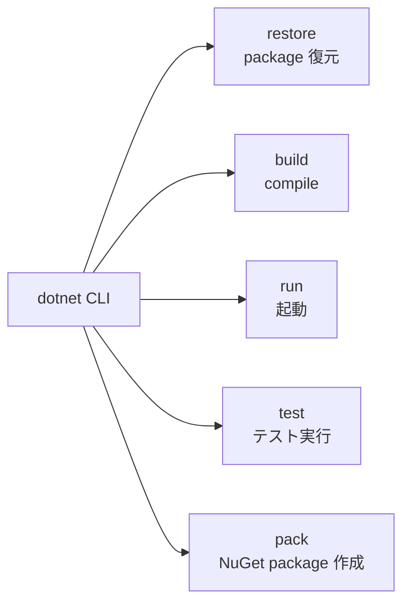

# .NET CLI と SDK

## 何を学ぶか

Krafter を使う最初の入口は Visual Studio の画面ではなく、`dotnet` CLI です。`dotnet new install` でテンプレートを入れ、`dotnet new krafter -n MyApp` でアプリを生成し、`dotnet run --project ...AppHost.csproj` で Aspire AppHost から起動します。

ここで学ぶべき中心は、.NET SDK が「プロジェクト作成」「依存関係の復元」「ビルド」「実行」「パッケージ作成」をまとめて扱うという考え方です。Krafter では `net10.0`、SDK-style project、`PackageReference`、`ProjectReference` が全体の土台です。

## キーワード

| キーワード | 意味 | 入門者向けの見方 |
|---|---|---|
| .NET SDK | build、run、test、pack などに必要な道具一式 | SDK がないと `dotnet` command は使えません |
| Runtime | build 済みアプリを動かす実行環境 | 開発者は通常 SDK を入れれば runtime も入ります |
| CLI | command line interface | `dotnet build` のように terminal から操作します |
| Solution | 複数 project を束ねる一覧 | `.slnx` は「何をまとめて扱うか」の地図です |
| Project | 実際の build 単位 | `*.csproj` に target framework や package が書かれます |
| `PackageReference` | NuGet package への依存 | 外部 library を使う宣言です |
| `ProjectReference` | 同じ repository 内の project への依存 | Contracts を Backend/UI から参照する時に使います |

## 図で見る CLI の役割



移動中に読むなら、`dotnet` は「.NET の作業机」だと考えると楽です。project を作る、材料を取ってくる、組み立てる、動かす、配布物にする、という一連の作業を同じ command family で行います。

## コマンド例

```bash
# SDK と runtime の情報を見る
dotnet --info

# solution 全体を build する
dotnet build AditiKraft.Krafter.Dev.slnx

# Aspire AppHost から local 環境を起動する
dotnet run --project aspire/AditiKraft.Krafter.Aspire.AppHost/AditiKraft.Krafter.Aspire.AppHost.csproj
```

この 3 つの command を読めるだけでも、Krafter の local 開発の会話についていきやすくなります。特に `--project` は「どの project を入口として実行するか」を指定しています。

## Krafterでの実装

- テンプレートの利用手順: [README.md](../../../README.md)
- Split Host solution: [AditiKraft.Krafter.slnx](../../../AditiKraft.Krafter.slnx)
- Single Host solution: [AditiKraft.Krafter.Single.slnx](../../../AditiKraft.Krafter.Single.slnx)
- 開発用 solution: [AditiKraft.Krafter.Dev.slnx](../../../AditiKraft.Krafter.Dev.slnx)
- Template package project: [AditiKraft.Krafter.Templates.csproj](../../../AditiKraft.Krafter.Templates.csproj)
- Backend project: [src/AditiKraft.Krafter.Backend/AditiKraft.Krafter.Backend.csproj](../../../src/AditiKraft.Krafter.Backend/AditiKraft.Krafter.Backend.csproj)
- Blazor client project: [src/UI/AditiKraft.Krafter.UI.Web.Client/AditiKraft.Krafter.UI.Web.Client.csproj](../../../src/UI/AditiKraft.Krafter.UI.Web.Client/AditiKraft.Krafter.UI.Web.Client.csproj)

`*.csproj` では `<TargetFramework>net10.0</TargetFramework>` が対象ランタイムを示し、`PackageReference` が NuGet package、`ProjectReference` が同一 solution 内の依存プロジェクトを示します。

## csproj の読み方

```xml
<Project Sdk="Microsoft.NET.Sdk.Web">
  <PropertyGroup>
    <TargetFramework>net10.0</TargetFramework>
  </PropertyGroup>

  <ItemGroup>
    <PackageReference Include="Microsoft.AspNetCore.OpenApi" Version="10.0.0" />
    <ProjectReference Include="..\AditiKraft.Krafter.Contracts\AditiKraft.Krafter.Contracts.csproj" />
  </ItemGroup>
</Project>
```

`Sdk` は project の種類を示します。Web app なら `Microsoft.NET.Sdk.Web`、Blazor WebAssembly client なら `Microsoft.NET.Sdk.BlazorWebAssembly` のように変わります。`TargetFramework` は .NET の対象バージョン、`PackageReference` は外部 package、`ProjectReference` は内部 project への依存です。

## 実務で必要な知識

`dotnet restore` は NuGet package を復元します。`dotnet build` はコンパイルします。`dotnet run --project <path>` は指定プロジェクトを実行します。`dotnet test` はテストプロジェクトを実行します。`dotnet pack` は NuGet package を作ります。Krafter のテンプレート開発では、このうち `build`、`run`、`pack`、`new install` を頻繁に使います。

実務では solution と project の違いも重要です。solution は複数 project の一覧で、project は実際のビルド単位です。Krafter には Split Host、Single Host、template 開発用の複数 solution があるため、どれをビルドしているかを意識してください。

また、SDK-style project は既定値が多い形式です。すべてのソースファイルを `csproj` に列挙しなくてもコンパイル対象になります。反対に、`PackageReference` や `ProjectReference` の追加は依存関係を変える操作なので、実装の影響範囲が広がります。

## 確認課題

- `dotnet --info` を実行し、インストール済み SDK のバージョンを確認する。
- `rg -n "TargetFramework|PackageReference|ProjectReference" -g "*.csproj"` を実行し、Krafter がどの package を使っているか見る。
- `AditiKraft.Krafter.Dev.slnx` と `AditiKraft.Krafter.slnx` の違いを説明する。

## 出典リンク

- [.NET CLI overview](https://learn.microsoft.com/en-us/dotnet/core/tools/dotnet)
- [dotnet build command](https://learn.microsoft.com/en-us/dotnet/core/tools/dotnet-build)
- [dotnet run command](https://learn.microsoft.com/en-us/dotnet/core/tools/dotnet-run)
- [.NET project SDK overview](https://learn.microsoft.com/en-us/dotnet/core/project-sdk/overview)
- [PackageReference in project files](https://learn.microsoft.com/en-us/nuget/consume-packages/package-references-in-project-files)
