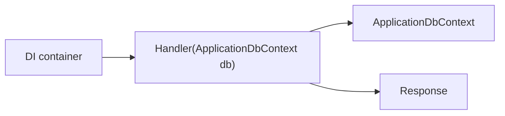

# Krafter で使われる C# 基礎

## 何を学ぶか

Krafter のコードを読むには、C# の文法を広く全部覚えるより、実装で頻出する形を先に押さえるのが近道です。特に nullable reference types、file-scoped namespace、primary constructor、`async` / `await`、dependency injection 前提のクラス設計を理解すると、Backend と UI のどちらも追いやすくなります。

## キーワード

| キーワード | 意味 | Krafter での見え方 |
|---|---|---|
| Nullable reference types | `null` になり得る参照を型で表す仕組み | `string` と `string?` を使い分けます |
| `default!` | 「あとで値が入る」と compiler に伝える記法 | DTO の non-null property で使われます |
| File-scoped namespace | file 全体の namespace を 1 行で書く形式 | `namespace AditiKraft.Krafter...;` |
| Primary constructor | class 宣言の横で constructor parameter を受け取る形式 | DI service を短く受け取れます |
| `async` / `await` | 待ち時間のある処理を非同期に書く仕組み | DB、HTTP、SignalR で頻出します |
| CancellationToken | 処理中断の合図を渡す型 | API request の終了や timeout に対応します |

## コードで見る頻出パターン

```csharp
namespace AditiKraft.Krafter.Backend.Features.Users;

public sealed class GetUsers
{
    internal sealed class Handler(ApplicationDbContext db) : IScopedHandler
    {
        public async Task<Response<PaginationResponse<UserDto>>> GetAsync(
            GetRequestInput request,
            CancellationToken cancellationToken)
        {
            List<UserDto> users = await db.Users
                .Select(user => new UserDto
                {
                    Id = user.Id,
                    Email = user.Email
                })
                .ToListAsync(cancellationToken);

            return Response<PaginationResponse<UserDto>>.Success(
                new PaginationResponse<UserDto>(users, users.Count, request.SkipCount, request.MaxResultCount));
        }
    }
}
```

この例で見てほしいのは、`ApplicationDbContext db` が primary constructor で渡されること、database query が `await` されること、戻り値が `Response<T>` に包まれることです。

## 図で見る依存関係の受け渡し



自分で `new Handler(...)` するのではなく、ASP.NET Core の DI container が必要な service を作って渡します。これが読めると、Krafter の constructor が急に短く見えてきます。

## Krafterでの実装

- Backend entry point: [src/AditiKraft.Krafter.Backend/Program.cs](../../../src/AditiKraft.Krafter.Backend/Program.cs)
- VSA operation: [src/AditiKraft.Krafter.Backend/Features/Users/GetUsers.cs](../../../src/AditiKraft.Krafter.Backend/Features/Users/GetUsers.cs)
- DI registration: [src/AditiKraft.Krafter.Backend/Web/HostingExtensions.cs](../../../src/AditiKraft.Krafter.Backend/Web/HostingExtensions.cs)
- Blazor code-behind: [src/UI/AditiKraft.Krafter.UI.Web.Client/Features/Users/Users.razor.cs](../../../src/UI/AditiKraft.Krafter.UI.Web.Client/Features/Users/Users.razor.cs)
- Shared response model: [src/AditiKraft.Krafter.Contracts/Common/Models/Response.cs](../../../src/AditiKraft.Krafter.Contracts/Common/Models/Response.cs)

Krafter では namespace は多くのファイルで file-scoped 形式です。たとえば `namespace AditiKraft.Krafter.Backend.Features.Users;` のように書くことで、そのファイル全体の namespace を指定しています。

## 実務で必要な知識

nullable reference types は、`string` と `string?` を区別して null の可能性をコンパイル時に見つける仕組みです。DTO では deserialization 後に値が入る前提の property に `= default!;` が使われます。これは「実行時に必ずセットされる」という開発者の意図をコンパイラに伝える書き方です。

primary constructor は `class Users(DialogService dialogService, ApiCallService api)` のように、クラス宣言の横で依存関係を受け取る書き方です。Krafter では DI container がこの constructor に service を渡します。`new` で直接作るより、DI に任せる設計が基本です。

`async` / `await` はデータベース、HTTP、SignalR、storage など待ち時間がある処理で使います。実務では `Task<T>` を返すメソッドでは例外や cancellation token の扱いも意識します。EF Core の query や Refit の API 呼び出しは必ず `await` し、同じ `DbContext` を並列に使わないようにします。

## 確認課題

- `src/AditiKraft.Krafter.Contracts/Contracts/Users/CreateUserRequest.cs` を開き、`string?` と `default!` の使い分けを確認する。
- `Users.razor.cs` の primary constructor に渡されている service がどこで登録されているか探す。
- `GetUsers.cs` の `ToListAsync` と `CountAsync` がなぜ `await` されているか説明する。

## 出典リンク

- [Nullable reference types](https://learn.microsoft.com/en-us/dotnet/csharp/nullable-references)
- [Namespaces and using directives](https://learn.microsoft.com/en-us/dotnet/csharp/fundamentals/types/namespaces)
- [Classes](https://learn.microsoft.com/en-us/dotnet/csharp/fundamentals/types/classes)
- [Asynchronous programming with async and await](https://learn.microsoft.com/en-us/dotnet/csharp/asynchronous-programming/)
- [Dependency injection in ASP.NET Core](https://learn.microsoft.com/en-us/aspnet/core/fundamentals/dependency-injection?view=aspnetcore-10.0)
