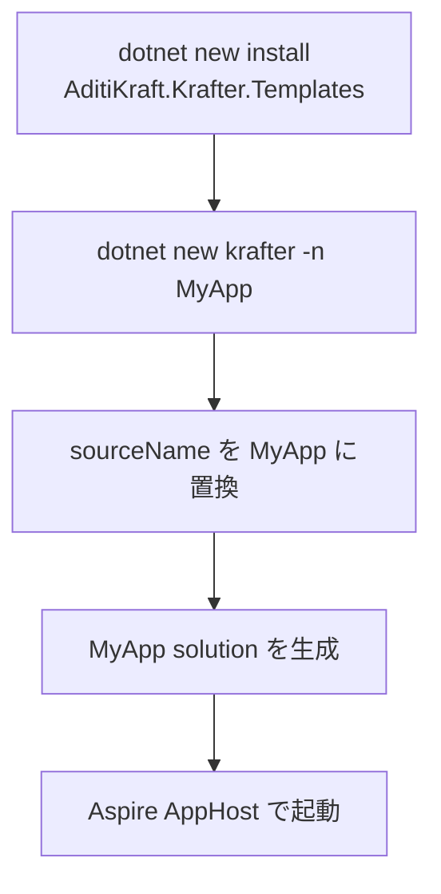

# dotnet new テンプレートの使い方

## 何を学ぶか

Krafter は clone して直接アプリを作るためのリポジトリではなく、`dotnet new` で新しいアプリを生成するテンプレートパックです。利用者は `dotnet new install AditiKraft.Krafter.Templates` を一度実行し、その後 `dotnet new krafter -n MyApp` または `dotnet new krafter-single -n MyApp` でプロジェクトを作ります。

## キーワード

| キーワード | 意味 | Krafter での見え方 |
|---|---|---|
| Template pack | 複数 template を含む NuGet package | `AditiKraft.Krafter.Templates` |
| `shortName` | `dotnet new` で指定する短い名前 | `krafter` / `krafter-single` |
| `sourceName` | 置換対象の元 namespace/name | `AditiKraft.Krafter` |
| Overlay | 共有 file の一部を別 file で差し替えること | Single Host 用に `src-single/` を重ねます |
| Post action | template 生成後に案内/実行する処理 | `dotnet restore` の案内があります |

## 図で見るテンプレート生成



Single Host の場合は、生成途中で `src-single/` と `aspire-single/` の file が標準 file を置き換えます。利用者から見ると command は 1 つですが、template engine の中では「共通部分を copy し、hosting model ごとの差分を重ねる」処理をしています。

## コマンド例

```bash
# 一度だけ template pack を入れる
dotnet new install AditiKraft.Krafter.Templates

# Split Host アプリを作る
dotnet new krafter -n MyApp

# Single Host アプリを作る
dotnet new krafter-single -n MyApp
```

`-n` は project 名だけでなく namespace や folder 名の置換にも使われます。入門者ほど、後から手で rename するより最初に `-n` を正しく指定するほうが安全です。

## Krafterでの実装

- 利用手順: [README.md](../../../README.md)
- Split Host template config: [.template.config/template.json](../../../.template.config/template.json)
- Single Host template config: [.template.config-single/template.json](../../../.template.config-single/template.json)
- Template package project: [AditiKraft.Krafter.Templates.csproj](../../../AditiKraft.Krafter.Templates.csproj)
- Single Host overlay source: [src-single/](../../../src-single/)
- Single Host Aspire overlay: [aspire-single/](../../../aspire-single/)

`template.json` の `shortName` が CLI で指定する名前です。Split Host は `krafter`、Single Host は `krafter-single` です。`sourceName` は `AditiKraft.Krafter` で、`-n MyApp` のように指定した名前で namespace、folder、project file が置換されます。

## template.json の最小イメージ

```json
{
  "identity": "AditiKraft.Krafter.FullStack.Template",
  "shortName": "krafter",
  "sourceName": "AditiKraft.Krafter",
  "preferNameDirectory": true
}
```

実際の Krafter の `template.json` はもっと長く、除外する file や rename rule も持っています。ただし最初に見るべき軸は `identity`、`shortName`、`sourceName` です。この 3 つが「どの template で、何という command で、どの文字列を置き換えるか」を決めます。

## 実務で必要な知識

テンプレートを使う側と、テンプレートを開発する側では作業が違います。使う側は生成されたアプリだけを変更します。テンプレート開発者はこのリポジトリを変更し、`dotnet pack` で template package を作り、`dotnet new install` でローカル検証します。

`template.json` の `sources` は、どのファイルを出力に含めるかを決めます。Single Host では root source から一部ファイルを除外し、`src-single/` と `aspire-single/` の overlay を同じ出力先にコピーします。この仕組みにより、共有コードは `src/` に置きつつ、起動方式だけを差し替えています。

実務では `-n` を必ず指定する習慣が重要です。名前を後から手作業で変更すると namespace、project reference、launchSettings、設定値がずれやすくなります。

## 確認課題

- `.template.config/template.json` と `.template.config-single/template.json` の `sources` を比較する。
- Single Host で除外される Split Host 用ファイルを 3 つ挙げる。
- `AditiKraft.Krafter.Templates.csproj` の `PackageId` と `PackageVersion` を確認する。

## 出典リンク

- [dotnet new command](https://learn.microsoft.com/en-us/dotnet/core/tools/dotnet-new)
- [Custom templates for dotnet new](https://learn.microsoft.com/en-us/dotnet/core/tools/custom-templates)
- [dotnet pack command](https://learn.microsoft.com/en-us/dotnet/core/tools/dotnet-pack)
- [Create and publish a NuGet package with the dotnet CLI](https://learn.microsoft.com/en-us/nuget/quickstart/create-and-publish-a-package-using-the-dotnet-cli)
