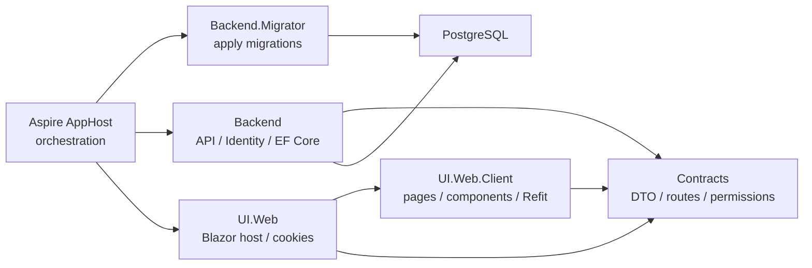

# ソリューション構成

## 何を学ぶか

Krafter を読む第一歩は、技術名よりもフォルダの責務を理解することです。Krafter は Contracts、Backend、Backend.Migrator、UI.Web、UI.Web.Client、Aspire AppHost、ServiceDefaults に分かれています。各プロジェクトが何を担当するかを知ると、機能追加時にどこを変更すべきか迷いにくくなります。

## キーワード

| キーワード | 意味 | 迷ったときの判断 |
|---|---|---|
| Contracts | Backend と UI の境界で共有する型 | DTO、route、permission はここ |
| Backend | API、認証、DB、jobs、SignalR | business rule と永続化はここ |
| UI.Web | Blazor Web App の server host | cookie、server-side auth、static assets |
| UI.Web.Client | browser 側で動く Blazor UI | page、component、Refit client |
| Migrator | DB migration を適用する短命 process | AppHost 起動時に先に走る |
| AppHost | local の複数 resource を起動する入口 | PostgreSQL、Migrator、API、UI の順序 |

## 図で見るプロジェクトの役割



大事なのは、Contracts が「共有される約束」で、Backend と UI のどちらか片方の都合だけで肥大化させないことです。Contracts に business logic が入り始めたら、境界が曖昧になっているサインです。

## Krafterでの実装

- 全体構成: [README.md](../../../README.md)
- AI agent 向け構成説明: [Agents.md](../../../Agents.md)
- Shared contracts: [src/AditiKraft.Krafter.Contracts/](../../../src/AditiKraft.Krafter.Contracts/)
- Backend API: [src/AditiKraft.Krafter.Backend/](../../../src/AditiKraft.Krafter.Backend/)
- Database migrator: [src/AditiKraft.Krafter.Backend.Migrator/](../../../src/AditiKraft.Krafter.Backend.Migrator/)
- Blazor Server host: [src/UI/AditiKraft.Krafter.UI.Web/](../../../src/UI/AditiKraft.Krafter.UI.Web/)
- Blazor WebAssembly client: [src/UI/AditiKraft.Krafter.UI.Web.Client/](../../../src/UI/AditiKraft.Krafter.UI.Web.Client/)
- Aspire orchestration: [aspire/](../../../aspire/)

Contracts は Backend と UI の両方から参照される DTO、route、permission、共通 model を持ちます。Backend は API、Identity、EF Core、jobs、SignalR を持ちます。UI.Web は Blazor Web App の server 側 host で、UI.Web.Client は WebAssembly 側の画面と client service を持ちます。

## 新機能を追加するときの mental model

```text
1. Contracts: request / response DTO、route、permission を定義する
2. Backend: handler と endpoint を作り、必要なら DbContext を拡張する
3. UI: Refit interface と page/component を作る
4. Aspire/Migrator: schema 変更があれば migration が AppHost 起動時に適用される
```

たとえば `Projects` 機能を作るなら、`Contracts/Projects`、`Backend/Features/Projects`、`UI.Web.Client/Features/Projects` が対応します。この対応関係を頭に入れておくと、既存の Users/Roles/Tenants を真似しやすくなります。

## 実務で必要な知識

Krafter で新機能を作る場合、変更は一箇所で完結しないことが多いです。たとえば新しい「Projects」機能なら、Contracts に DTO と route、Backend に VSA operation、DbContext に DbSet、UI に Refit interface と page、MenuService に menu、PermissionCatalog に permission を追加します。

一方で、何でも共有化すればよいわけではありません。Contracts は「Backend と UI の境界で共有するもの」に限定します。Backend の business logic や EF entity を Contracts に置くと、UI が知るべきではない実装詳細が漏れます。

Migrator は通常の API とは別プロセスです。AppHost が PostgreSQL を起動し、Migrator が migration を適用し、それから API/UI を起動します。ローカル開発ではこの順序を意識すると、起動時のエラーを切り分けやすくなります。

## 確認課題

- `AditiKraft.Krafter.Dev.slnx` を読み、各 project がどの folder に分類されているか確認する。
- `src/AditiKraft.Krafter.Contracts/Common/ApiRoutes.cs` が Backend と UI のどちらで使われるか `rg "ApiRoutes.Users"` で調べる。
- `src/AditiKraft.Krafter.Backend.Migrator/Program.cs` と Backend の `Program.cs` の違いを説明する。

## 出典リンク

- [.NET project SDK overview](https://learn.microsoft.com/en-us/dotnet/core/project-sdk/overview)
- [Dependency injection in ASP.NET Core](https://learn.microsoft.com/en-us/aspnet/core/fundamentals/dependency-injection?view=aspnetcore-10.0)
- [What is Aspire?](https://learn.microsoft.com/en-us/dotnet/aspire/get-started/aspire-overview)
- [DbContext Lifetime, Configuration, and Initialization](https://learn.microsoft.com/en-us/ef/core/dbcontext-configuration/)
