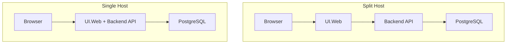

# Split Host と Single Host

## 何を学ぶか

Krafter には 2 つの hosting model があります。Split Host は Backend API と Blazor UI を別プロセスで動かします。Single Host は API と UI を同じ ASP.NET Core process にまとめます。どちらも同じ業務コードを使いますが、起動構成、CORS、Refit の宛先、BFF 的な cookie 処理が変わります。

## キーワード

| キーワード | 意味 | Split / Single での違い |
|---|---|---|
| Host | ASP.NET Core app の実行単位 | Split は API と UI が別 host |
| Process | OS 上で動く実行単位 | Single は API+UI が 1 process |
| CORS | 別 origin から API を呼ぶための制御 | Split では重要、Single では単純 |
| BFF | browser と backend の間で token/cookie を管理する層 | UI.Web がその役目を持ちます。Browser は cookie 経由で UI.Web と通信し、UI.Web が Backend API への JWT を管理します。JavaScript から JWT が見えなくなるため、XSS によるトークン盗難を防ぎます |
| Overlay | template 生成時に差分 file を重ねる方式 | Single Host の起動 file を差し替えます |

## 図で見る違い



Split Host は境界が明確で、将来 API を別 client から呼びやすい構成です。Single Host は動かすものが少なく、deployment と local 理解が簡単です。どちらが優れているというより、チームと運用の複雑さに合わせて選ぶものです。

## Krafterでの実装

- Split Host template: [.template.config/template.json](../../../.template.config/template.json)
- Single Host template: [.template.config-single/template.json](../../../.template.config-single/template.json)
- Split Host AppHost: [aspire/AditiKraft.Krafter.Aspire.AppHost/Program.cs](../../../aspire/AditiKraft.Krafter.Aspire.AppHost/Program.cs)
- Single Host AppHost overlay: [aspire-single/AditiKraft.Krafter.Aspire.AppHost/Program.cs](../../../aspire-single/AditiKraft.Krafter.Aspire.AppHost/Program.cs)
- Split Host UI.Web: [src/UI/AditiKraft.Krafter.UI.Web/Program.cs](../../../src/UI/AditiKraft.Krafter.UI.Web/Program.cs)
- Single Host UI.Web overlay: [src-single/UI/AditiKraft.Krafter.UI.Web/Program.cs](../../../src-single/UI/AditiKraft.Krafter.UI.Web/Program.cs)
- Shared backend registration: [src/AditiKraft.Krafter.Backend/Web/HostingExtensions.cs](../../../src/AditiKraft.Krafter.Backend/Web/HostingExtensions.cs)

Split Host の AppHost は `api` と `web` の 2 つの project resource を登録します。Single Host の AppHost は `krafter-app` だけを登録し、`RemoteHostUrl` に自分自身の HTTPS endpoint を注入します。

## AppHost の最小イメージ

```csharp
// Split Host: API と Web を別 resource として登録する
IResourceBuilder<ProjectResource> backend = builder.AddProject<Projects.AditiKraft_Krafter_Backend>("api")
    .WithReference(database)
    .WaitForCompletion(migrator);

builder.AddProject<Projects.AditiKraft_Krafter_UI_Web>("web")
    .WithExternalHttpEndpoints()
    .WithReference(backend)
    .WithReference(database);
```

```csharp
// Single Host: UI.Web が Backend services も同じ process に持つ
IResourceBuilder<ProjectResource> app = builder.AddProject<Projects.AditiKraft_Krafter_UI_Web>("krafter-app")
    .WithExternalHttpEndpoints()
    .WithReference(database)
    .WaitForCompletion(migrator);

app.WithEnvironment("RemoteHostUrl", app.GetEndpoint("https"));
```

この差は、後で Refit の BaseAddress や cookie 処理を読むときに効いてきます。Split では「UI から API へ呼ぶ」、Single では「同じ app 内の API を呼ぶ」という違いです。

## 実務で必要な知識

Split Host は API と UI の境界が明確です。将来 mobile app や外部 client を追加する場合、API を独立して扱いやすくなります。ただし、CORS、token transfer、service discovery の理解が必要です。

Single Host は構成が単純です。API と UI が同じ process にあるため、deployment unit が少なくなります。ただし、Backend の middleware と Blazor の middleware が同じ pipeline に入るため、順序が重要になります。`UseBackendMiddleware`、`AuthCookieMiddleware`、`MapBackendEndpoints`、`MapRazorComponents` の並びを理解してください。

テンプレートとしては、Single Host は overlay 方式です。共有コードを duplicate せず、起動構成だけを `src-single/` と `aspire-single/` で差し替えます。実務でテンプレートを修正するときは、Split Host と Single Host の両方で必要な修正か、片方だけの修正かを見極めます。

## 確認課題

- Split Host AppHost の `WithReference(backend)` と Single Host AppHost の `RemoteHostUrl` 注入の違いを説明する。
- `.template.config-single/template.json` で overlay されるファイルを確認する。
- `src-single/UI/.../Program.cs` にだけ存在する backend service registration を探す。

## 出典リンク

- [What is the AppHost?](https://learn.microsoft.com/en-us/dotnet/aspire/fundamentals/app-host-overview)
- [Service discovery in Aspire](https://learn.microsoft.com/en-us/dotnet/aspire/service-discovery/overview)
- [ASP.NET Core Middleware](https://learn.microsoft.com/en-us/aspnet/core/fundamentals/middleware/?view=aspnetcore-10.0)
- [ASP.NET Core Blazor render modes](https://learn.microsoft.com/en-us/aspnet/core/blazor/components/render-modes?view=aspnetcore-10.0)
