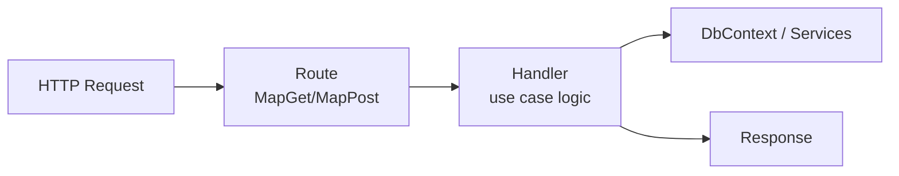

# Vertical Slice Architecture

## 何を学ぶか

Vertical Slice Architecture は、技術レイヤーごとではなく、ユースケースや機能単位でコードをまとめる考え方です。Krafter の Backend では、`Features/Users/GetUsers.cs` のように、1 つの operation file に handler と route mapping を近づけています。

## キーワード

| キーワード | 意味 | Krafter での見え方 |
|---|---|---|
| Vertical slice | 1 つのユースケースを縦に切った単位 | `GetUsers`、`CreateTenant` など |
| Operation file | 1 endpoint/use case の中心 file | Handler と Route を近くに置きます |
| Handler | business 処理を実行する class | DB query、service 呼び出し、response 作成 |
| Route registrar | endpoint を `MapGet` などで登録する class | `IRouteRegistrar` 実装 |
| Cross-cutting | 機能横断の仕組み | 認証、tenant、例外、validation |

## 図で見る VSA



従来の「Controller 層、Service 層、Repository 層」を横に分ける見方ではなく、「ユーザー一覧を取得する」という 1 つの目的で必要なものを近くに置くのが VSA の感覚です。
従来のレイヤー構成では `UsersController`、`IUserService`、`UserService`、`IUserRepository`、`UserRepository` が別々のフォルダに分散します。VSA では `GetUsers.cs` 1 ファイルに handler と route が近くに置かれるため、機能変更の影響範囲が 1 か所で完結しやすくなります。

## Krafterでの実装

- Backend agent rules: [src/AditiKraft.Krafter.Backend/Agents.md](../../../src/AditiKraft.Krafter.Backend/Agents.md)
- Users list operation: [src/AditiKraft.Krafter.Backend/Features/Users/GetUsers.cs](../../../src/AditiKraft.Krafter.Backend/Features/Users/GetUsers.cs)
- Tenant create operation: [src/AditiKraft.Krafter.Backend/Features/Tenants/CreateTenant.cs](../../../src/AditiKraft.Krafter.Backend/Features/Tenants/CreateTenant.cs)
- Handler marker: [src/AditiKraft.Krafter.Backend/Features/IScopedHandler.cs](../../../src/AditiKraft.Krafter.Backend/Features/IScopedHandler.cs)
- Route registrar: [src/AditiKraft.Krafter.Backend/Web/IRouteRegistrar.cs](../../../src/AditiKraft.Krafter.Backend/Web/IRouteRegistrar.cs)
- Handler auto registration: [src/AditiKraft.Krafter.Backend/Infrastructure/Persistence/PersistenceConfiguration.cs](../../../src/AditiKraft.Krafter.Backend/Infrastructure/Persistence/PersistenceConfiguration.cs)

Krafter の operation は、`Handler` が処理を実行し、`Route` が Minimal API endpoint を map します。DTO と validator は Contracts 側に置き、Backend-only DTO を増やさない方針です。

`IRouteRegistrar` の実装クラスは、起動時のリフレクションスキャンで自動検出され、`MapRoute` が呼び出されます。おかげで新しい `Route` クラスを追加するだけで自動的に endpoint が登録される設計になっています。同様に `IScopedHandler` を実装した `Handler` クラスもリフレクションで一括登録されます。

## operation file の最小形

```csharp
public sealed class GetActiveUsers
{
    internal sealed class Handler(ApplicationDbContext db) : IScopedHandler
    {
        public async Task<Response<List<UserDto>>> GetAsync(CancellationToken cancellationToken)
        {
            List<UserDto> data = await db.Users
                .Where(user => user.IsActive)
                .Select(user => new UserDto { Id = user.Id, Email = user.Email })
                .ToListAsync(cancellationToken);

            return Response<List<UserDto>>.Success(data);
        }
    }

    public sealed class Route : IRouteRegistrar
    {
        public void MapRoute(IEndpointRouteBuilder endpoints)
        {
            endpoints.MapGroup(ApiRoutes.Users)
                .MapGet("/", async ([FromServices] Handler handler, CancellationToken ct) =>
                    Results.Json(await handler.GetAsync(ct)))
                .MustHavePermission(PermissionAction.View, PermissionResource.Users);
        }
    }
}
```

これは説明用の簡略例です。実際の Krafter では `GetUsers.cs` のように pagination、validation filter、`.Produces<Response<T>>()`、route constants を既存 pattern に合わせます。

> **`.MustHavePermission` について**: endpoint にアクセス制御を付ける拡張メソッドです。`PermissionAction.View` や `PermissionResource.Users` のような定数は `PermissionCatalog` で管理されています。Permission の詳細は第 14 回で説明します。

## 実務で必要な知識

VSA の利点は、機能変更の影響範囲を見つけやすいことです。たとえば user 一覧の条件を変えるなら `GetUsers.cs` を中心に読めます。従来の Controller、Service、Repository、DTO、Profile がばらばらに分散する構造より、ひとつの use case を追いやすくなります。

ただし、共通化の判断には注意が必要です。複数 operation で本当に共有する処理だけを `Common/` や service に出します。早すぎる service 化は、VSA の見通しの良さを失わせます。

実務では「operation file が肥大化したら分割」ではなく、「その use case の理解に必要なものは近くに置く」という視点を持ちます。validation、permission、route、response shape は operation と一緒に確認できるべきです。

## 確認課題

- `GetUsers.cs` の `Handler` と `Route` の責務を分けて説明する。
- `src/AditiKraft.Krafter.Backend/Features/Users/GetUsers.cs` を開き、Handler クラスと Route クラスがどのような役割分担をしているか自分の言葉でメモする。
- 新しい `Projects` 一覧 endpoint を追加すると仮定し、Contracts / Backend / UI の変更場所をメモする。

## 出典リンク

- [Vertical Slice Architecture by Jimmy Bogard](https://www.jimmybogard.com/vertical-slice-architecture/)
- [Minimal APIs quick reference](https://learn.microsoft.com/en-us/aspnet/core/fundamentals/minimal-apis?view=aspnetcore-9.0)
- [Dependency injection in ASP.NET Core](https://learn.microsoft.com/en-us/aspnet/core/fundamentals/dependency-injection?view=aspnetcore-10.0)
- [Policy-based authorization in ASP.NET Core](https://learn.microsoft.com/en-us/aspnet/core/security/authorization/policies?view=aspnetcore-10.0)
