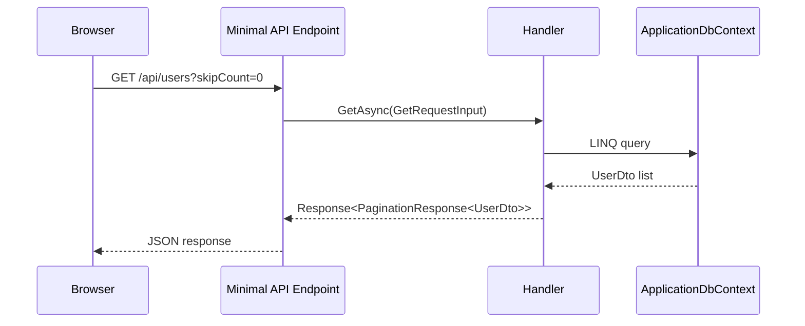

# ASP.NET Core Minimal APIs

## 何を学ぶか

Krafter の Backend は Controller ではなく Minimal APIs を中心に構成されています。`MapGet`、`MapPost`、`MapPut`、`MapDelete` で endpoint を登録し、`RouteGroupBuilder` で feature ごとの route group を作ります。OpenAPI と Scalar によって API 仕様も確認できます。

## キーワード

| キーワード | 意味 | Krafter での見え方 |
|---|---|---|
| Endpoint | HTTP request を受ける入口 | `MapGet`, `MapPost` など |
| Route | URL path と HTTP method の組み合わせ | `/api/users` |
| Route group | 共通 prefix や filter をまとめる group | `MapGroup(ApiRoutes.Users)` |
| Handler parameter | endpoint が受け取る引数 | `[FromServices]`, `[FromBody]`, `[AsParameters]` |
| Endpoint filter | endpoint の前後に入る処理 | validation filter |
| OpenAPI | API 仕様を機械可読に表す document | Scalar の API reference に使われます |

## 図で見る request の流れ



移動中に読むなら、`MapGet` は「この URL に GET が来たら、この関数を動かす」という対応表だと考えると十分です。

## Krafterでの実装

- Backend entry point: [src/AditiKraft.Krafter.Backend/Program.cs](../../../src/AditiKraft.Krafter.Backend/Program.cs)
- Endpoint mapping extension: [src/AditiKraft.Krafter.Backend/Web/HostingExtensions.cs](../../../src/AditiKraft.Krafter.Backend/Web/HostingExtensions.cs)
- Route discovery: [src/AditiKraft.Krafter.Backend/Web/RouteConfiguration.cs](../../../src/AditiKraft.Krafter.Backend/Web/Configuration/RouteConfiguration.cs)
- Swagger/Scalar configuration: [src/AditiKraft.Krafter.Backend/Web/Configuration/SwaggerConfiguration.cs](../../../src/AditiKraft.Krafter.Backend/Web/Configuration/SwaggerConfiguration.cs)
- Example endpoint: [src/AditiKraft.Krafter.Backend/Features/Users/GetUsers.cs](../../../src/AditiKraft.Krafter.Backend/Features/Users/GetUsers.cs)

各 operation の `Route` class は `IRouteRegistrar` を実装し、`MapRoute` で endpoint を追加します。`MapBackendEndpoints()` が route discovery 経由でそれらをまとめて登録します。

## Minimal API の最小コード例

```csharp
RouteGroupBuilder userGroup = endpointRouteBuilder.MapGroup(ApiRoutes.Users)
    .AddFluentValidationFilter();

userGroup.MapGet("/", async (
        [FromServices] GetUsers.Handler handler,
        [AsParameters] GetRequestInput requestInput,
        CancellationToken cancellationToken) =>
    {
        Response<PaginationResponse<UserDto>> res =
            await handler.GetAsync(requestInput, cancellationToken);

        return Results.Json(res, statusCode: res.StatusCode);
    })
    .Produces<Response<PaginationResponse<UserDto>>>()
    .MustHavePermission(PermissionAction.View, PermissionResource.Users);
```

読みどころは 4 つです。`MapGroup` で prefix を作る、`[FromServices]` で DI から handler を受ける、`[AsParameters]` で query をまとめて受ける、最後に permission と response schema を宣言する、という順です。

## 実務で必要な知識

Minimal APIs では endpoint handler の引数に `[FromServices]`、`[FromBody]`、`[AsParameters]` などを使って、DI service、request body、query parameter を受け取ります。Krafter の一覧系 endpoint は `GetRequestInput` を `[AsParameters]` で受け取り、pagination、filter、sort に使います。

`.Produces<Response<T>>()` は OpenAPI document の response schema を正しくするために重要です。UI client や API reference に影響するため、新しい endpoint を追加したら response type も忘れずに記述します。

`AddFluentValidationFilter()` は endpoint filter として validation を差し込みます。Minimal APIs では MVC の model validation と違うため、Krafter の既存 filter を使うことが大切です。

## 確認課題

- `GetUsers.cs` の `MapGet` がどの route に対応するか、`ApiRoutes.Users` と合わせて確認する。
- `CreateTenant.cs` の `MapPost` で body、service、cancellation token がどう渡されるか読む。
- Scalar API Reference の URL が README にどう記載されているか確認する。

## 出典リンク

- [Minimal APIs quick reference](https://learn.microsoft.com/en-us/aspnet/core/fundamentals/minimal-apis?view=aspnetcore-9.0)
- [Filters in Minimal API apps](https://learn.microsoft.com/en-us/aspnet/core/fundamentals/minimal-apis/min-api-filters?view=aspnetcore-10.0)
- [OpenAPI support in ASP.NET Core API apps](https://learn.microsoft.com/en-us/aspnet/core/fundamentals/openapi/overview?view=aspnetcore-10.0)
- [Use the generated OpenAPI documents](https://learn.microsoft.com/en-us/aspnet/core/fundamentals/openapi/using-openapi-documents?view=aspnetcore-9.0)
- [Scalar ASP.NET Core integration](https://guides.scalar.com/products/api-references/integrations/aspnetcore/integration)
