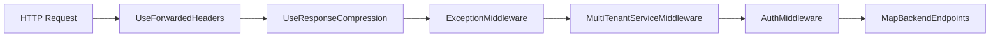

# DI、Options、Middleware

## 何を学ぶか

ASP.NET Core アプリは、service registration と middleware pipeline の組み合わせで動きます。Krafter では `AddBackendServices()` が DB、認証、永続化、通知、validation、jobs、SignalR、OpenAPI を登録し、`UseBackendMiddleware()` が exception、multi-tenancy、auth の middleware を pipeline に追加します。

## キーワード

| キーワード | 意味 | Krafter での見え方 |
|---|---|---|
| Service registration | DI container に service を登録すること | `builder.Services.AddScoped(...)` |
| Lifetime | service instance をどれくらい使い回すか | Scoped / Singleton / Transient |
| Options pattern | 設定値を型として扱う仕組み | `JwtSettings` |
| Middleware | HTTP request の通り道に入る処理 | exception、tenant、auth |
| Pipeline | middleware が並ぶ順序 | `Use...` の順番が意味を持つ |

## 図で見る Backend pipeline



Middleware は順番が大事です。たとえば tenant が決まる前に DbContext query が動くと、tenant-aware な filter が正しく働きません。

## Krafterでの実装

- Backend service registration: [src/AditiKraft.Krafter.Backend/Web/HostingExtensions.cs](../../../src/AditiKraft.Krafter.Backend/Web/HostingExtensions.cs)
- Auth DI and options: [src/AditiKraft.Krafter.Backend/Web/DependencyInjection.cs](../../../src/AditiKraft.Krafter.Backend/Web/DependencyInjection.cs)
- Database registration: [src/AditiKraft.Krafter.Backend/Web/Configuration/DatabaseConfiguration.cs](../../../src/AditiKraft.Krafter.Backend/Web/Configuration/DatabaseConfiguration.cs)
- Exception middleware: [src/AditiKraft.Krafter.Backend/Web/Middleware/ExceptionMiddleware.cs](../../../src/AditiKraft.Krafter.Backend/Web/Middleware/ExceptionMiddleware.cs)
- Multi-tenant middleware: [src/AditiKraft.Krafter.Backend/Web/Middleware/MultiTenantServiceMiddleware.cs](../../../src/AditiKraft.Krafter.Backend/Web/Middleware/MultiTenantServiceMiddleware.cs)
- UI host middleware: [src/UI/AditiKraft.Krafter.UI.Web/Program.cs](../../../src/UI/AditiKraft.Krafter.UI.Web/Program.cs)

`AddOptions<JwtSettings>().BindConfiguration(...).ValidateDataAnnotations().ValidateOnStart()` は、設定ファイルの値を型付き option として検証する例です。

## DI と Options のコード例

```csharp
builder.Services.AddOptions<JwtSettings>()
    .BindConfiguration($"SecuritySettings:{nameof(JwtSettings)}")
    .ValidateDataAnnotations()
    .ValidateOnStart();

builder.Services.AddScoped<IUserService, UserService>();
builder.Services.AddScoped<IRoleService, RoleService>();
builder.Services.AddScoped<ITokenService, TokenService>();
```

`AddScoped` は request ごとに service instance を作る lifetime です。DbContext や user/role service のように request の文脈を持つ処理は scoped が自然です。`ValidateOnStart` は設定値の不足を起動時に見つけるための保険です。

## 実務で必要な知識

DI は「必要なものを constructor で受け取る」仕組みです。Krafter の handler や service は `ApplicationDbContext db`、`IUserService userService` のように依存関係を受け取ります。実装者は service がどこで `AddScoped`、`AddSingleton`、`AddTransient` されているかを追える必要があります。

Options pattern は `appsettings.json` などの設定を型として扱う方法です。JWT、CORS、database、notification など、環境ごとに変わる値はコードに直接書かず、configuration から読みます。

Middleware は HTTP request の通り道です。順序が重要で、認証前に tenant context が必要な場合や、例外処理を最初に置く場合があります。Krafter では Backend 単独 host と Single Host で pipeline が異なるため、`Program.cs` の順序を必ず確認してください。

## 確認課題

- `AddBackendServices()` 内で登録される service をカテゴリごとに分類する。
- `UseBackendMiddleware()` の順序を変えると何が起きそうか考える。
- `JwtSettings` がどの設定 section から bind されるか確認する。

## 出典リンク

- [Dependency injection in ASP.NET Core](https://learn.microsoft.com/en-us/aspnet/core/fundamentals/dependency-injection?view=aspnetcore-10.0)
- [Options pattern in ASP.NET Core](https://learn.microsoft.com/en-us/aspnet/core/fundamentals/configuration/options?view=aspnetcore-10.0)
- [ASP.NET Core Middleware](https://learn.microsoft.com/en-us/aspnet/core/fundamentals/middleware/?view=aspnetcore-10.0)
- [Write custom ASP.NET Core middleware](https://learn.microsoft.com/en-us/aspnet/core/fundamentals/middleware/write?view=aspnetcore-10.0)
