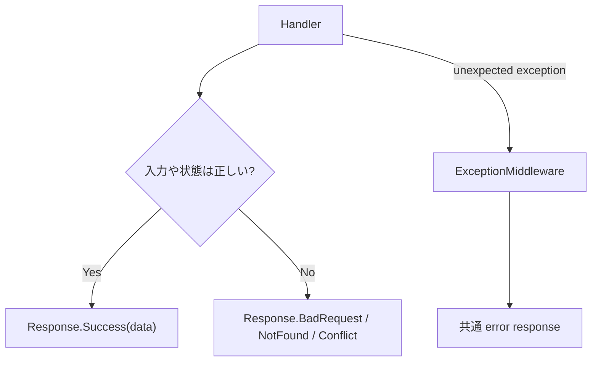

# Response、Validation、Error Handling

## 何を学ぶか

Krafter の API は raw object を直接返すのではなく、`Response` または `Response<T>` に包んで返します。Validation は FluentValidation を使い、想定外の例外は exception middleware で一貫した response に変換します。

## キーワード

| キーワード | 意味 | Krafter での見え方 |
|---|---|---|
| `Response<T>` | API response の共通 wrapper | `Data`, `IsError`, `StatusCode` |
| Validation | request が正しい形か確認する処理 | FluentValidation |
| Business error | 想定内の失敗 | `BadRequest`, `NotFound`, `Conflict` |
| Exception | 想定外の失敗 | `ExceptionMiddleware` が扱う |
| Error shape | UI が扱いやすい失敗 response の形 | `ErrorResult` |

## 図で見る成功と失敗



入門者が混乱しやすい点は、「失敗がすべて例外ではない」ということです。重複 email や存在しない id など、予想できる失敗は response として返します。

## Krafterでの実装

- Shared response model: [src/AditiKraft.Krafter.Contracts/Common/Models/Response.cs](../../../src/AditiKraft.Krafter.Contracts/Common/Models/Response.cs)
- Shared contract rules: [src/AditiKraft.Krafter.Contracts/Agents.md](../../../src/AditiKraft.Krafter.Contracts/Agents.md)
- Backend validation registration: [src/AditiKraft.Krafter.Backend/Web/HostingExtensions.cs](../../../src/AditiKraft.Krafter.Backend/Web/HostingExtensions.cs)
- Exception middleware: [src/AditiKraft.Krafter.Backend/Web/Middleware/ExceptionMiddleware.cs](../../../src/AditiKraft.Krafter.Backend/Web/Middleware/ExceptionMiddleware.cs)
- App exception type: [src/AditiKraft.Krafter.Backend/Errors/AppException.cs](../../../src/AditiKraft.Krafter.Backend/Errors/AppException.cs)
- Request validator example: [src/AditiKraft.Krafter.Contracts/Contracts/Users/CreateUserRequest.cs](../../../src/AditiKraft.Krafter.Contracts/Contracts/Users/CreateUserRequest.cs)

`Response<T>` には `IsError`、`StatusCode`、`Data`、`Message`、`Error` があり、UI はこれを見て成功/失敗を判断します。

## Response と Validator のコード例

```csharp
public static Response<T> Success(T data, string? message = null) => new()
{
    IsError = false,
    StatusCode = (int)HttpStatusCode.OK,
    Data = data,
    Message = message
};
```

```csharp
public class CreateUserRequestValidator : AbstractValidator<CreateUserRequest>
{
    public CreateUserRequestValidator()
    {
        RuleFor(p => p.FirstName).NotEmpty();
        RuleFor(p => p.Email).NotEmpty().EmailAddress();
    }
}
```

Response は API と UI の会話の形をそろえます。Validator は request の入口で「そもそも処理してよい入力か」を判断します。この 2 つを分けると、handler の中に if 文が増えすぎるのを防げます。

## 実務で必要な知識

API の response shape が揃っていると、UI 側の error handling が単純になります。Krafter の UI では `ApiCallService` が `Response` を受け、成功 message や error notification を扱います。新しい endpoint でも同じ response wrapper を使うことで、UI の共通処理に乗せられます。

Validation は request DTO と同じ Contracts 側に置く方針です。Backend と UI の両方が同じ入力制約を理解できるため、重複やずれを減らせます。ただし、DB 状態に依存する検証や権限判定など、server でしか判断できない処理は handler 側で行います。

Exception middleware は想定外エラーをまとめて扱います。ただし、通常の business error は例外ではなく `Response.BadRequest`、`Response.NotFound`、`Response.Conflict` などで返すほうが、handler の意図が読みやすくなります。

## 確認課題

- `Response<T>.Success` と `Response<T>.BadRequest` の違いを確認する。
- `CreateUserRequestValidator` がどの property を検証しているか読む。
- UI の `ApiCallService` が `Response.IsError` をどう扱うか確認する。

## 出典リンク

- [FluentValidation dependency injection](https://docs.fluentvalidation.net/en/latest/di.html)
- [FluentValidation ASP.NET Core](https://docs.fluentvalidation.net/en/latest/aspnet.html)
- [Filters in Minimal API apps](https://learn.microsoft.com/en-us/aspnet/core/fundamentals/minimal-apis/min-api-filters?view=aspnetcore-10.0)
- [ASP.NET Core error handling](https://learn.microsoft.com/en-us/aspnet/core/fundamentals/error-handling?view=aspnetcore-10.0)
