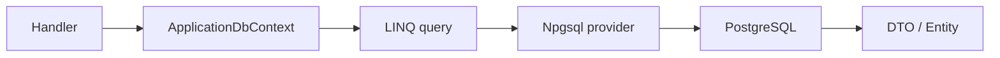

# EF Core と PostgreSQL

## 何を学ぶか

Krafter の永続化は Entity Framework Core と PostgreSQL が中心です。EF Core は C# の entity と `DbContext` を通じて database を扱う ORM です。PostgreSQL への接続には Npgsql provider を使います。

EF Core は Python の SQLAlchemy や Node.js の Prisma に近い役割で、SQL を直接書かずに C# の LINQ（クエリ構文）で操作できます。`db.Users.Where(...).Select(...)` のような記述が SQL `SELECT ... WHERE ...` に変換されます。

## キーワード

| キーワード | 意味 | Krafter での見え方 |
|---|---|---|
| ORM | object と database table を対応させる仕組み | EF Core |
| `DbContext` | database との作業単位 | `ApplicationDbContext` |
| `DbSet<T>` | table に近い query/update の入口 | `Users`, `UserRefreshTokens` |
| LINQ | C# で query を書く構文 | `Where`, `Select`, `OrderBy` |
| Change tracker | entity の変更状態を追跡する仕組み | `SaveChangesAsync` 前に働きます |
| Provider | DB 製品ごとの差を吸収する library | Npgsql for PostgreSQL |

## 図で見る EF Core の流れ



EF Core は SQL を完全に隠す魔法ではありません。C# の LINQ が SQL に変換され、provider が PostgreSQL に合わせて実行します。

## Krafterでの実装

- Database registration: [src/AditiKraft.Krafter.Backend/Web/Configuration/DatabaseConfiguration.cs](../../../src/AditiKraft.Krafter.Backend/Web/Configuration/DatabaseConfiguration.cs)
- Main DbContext: [src/AditiKraft.Krafter.Backend/Infrastructure/Persistence/ApplicationDbContext.cs](../../../src/AditiKraft.Krafter.Backend/Infrastructure/Persistence/ApplicationDbContext.cs)
- Tenant registry DbContext: [src/AditiKraft.Krafter.Backend/Infrastructure/Persistence/TenantDbContext.cs](../../../src/AditiKraft.Krafter.Backend/Infrastructure/Persistence/TenantDbContext.cs)
- Background jobs DbContext: [src/AditiKraft.Krafter.Backend/Infrastructure/Jobs/BackgroundJobsContext.cs](../../../src/AditiKraft.Krafter.Backend/Infrastructure/Jobs/BackgroundJobsContext.cs)
- Database selector: [src/AditiKraft.Krafter.Backend/Common/DatabaseSelected.cs](../../../src/AditiKraft.Krafter.Backend/Common/DatabaseSelected.cs)

`DatabaseConfiguration` は `appDb` connection string を読み、`UseNpgsql(connectionString)` で PostgreSQL provider を設定します。Krafter では application、tenant registry、background jobs の 3 つの DbContext が同じ database connection を使います。

## DbContext 登録のコード例

次のコードは PostgreSQL provider（Npgsql）を DbContext に接続する最小設定です。接続文字列だけ渡せばよく、SQL ドライバの細かい設定は provider が吸収します。

```csharp
services.AddDbContext<ApplicationDbContext>(opts =>
{
    opts.UseNpgsql(connectionString);
});
```

次の LINQ の例は「C# コードが SQL に変換される」流れを見るためのものです。`.Where(...)` で絞り込み、`.Select(...)` で必要なプロパティだけ DTO に射影（projection）し、`.ToListAsync(...)` でその時点で SQL が実行されます。Krafter では `!user.IsDeleted` のような条件を毎回書かなくても global query filter が自動で付けてくれます。

```csharp
List<UserDto> items = await db.Users
    .Where(user => !user.IsDeleted)
    .Select(user => new UserDto
    {
        Id = user.Id,
        Email = user.Email
    })
    .ToListAsync(cancellationToken);
```

Krafter では実際には global query filter があるため、毎回 `!user.IsDeleted` を書くわけではありません。この例は「LINQ query が DTO に投影され、`ToListAsync` で実行される」という流れを見るためのものです。

## 実務で必要な知識

`DbContext` は unit of work です。HTTP request 内で必要な entity を query し、変更し、`SaveChangesAsync` で database に反映します。Krafter の handler では DI から `ApplicationDbContext` や `TenantDbContext` を受け取り、LINQ で query を書きます。

EF Core は entity の状態を change tracker で追跡します。Krafter の `ApplicationDbContext` は `SaveChanges` / `SaveChangesAsync` を override し、追加・更新・削除時に tenant id、audit 情報、soft delete を設定します。そのため、handler 側で毎回 `TenantId` や `CreatedOn` を手で入れるより、DbContext の共通処理を理解して使うことが大切です。

実務では LINQ query が database query に変換されることも意識します。`ToListAsync` する前に `Where`、`Select`、`OrderBy`、pagination を組み立てると、database 側で効率よく処理できます。

## 確認課題

- `ApplicationDbContext.OnModelCreating` で `ApplicationUser` に設定されている index と query filter を確認する。
- `GetUsers.cs` の LINQ query がどこで database に実行されるか説明する。
- `DatabaseConfiguration.cs` に PostgreSQL 以外の provider が未対応な理由を考える。

## 出典リンク

- [Overview of Entity Framework Core](https://learn.microsoft.com/en-us/ef/core/)
- [DbContext Lifetime, Configuration, and Initialization](https://learn.microsoft.com/en-us/ef/core/dbcontext-configuration/)
- [Change Tracking in EF Core](https://learn.microsoft.com/en-us/ef/core/change-tracking/)
- [Basic SaveChanges](https://learn.microsoft.com/en-us/ef/core/saving/basic)
- [Npgsql documentation](https://www.npgsql.org/index.html)
