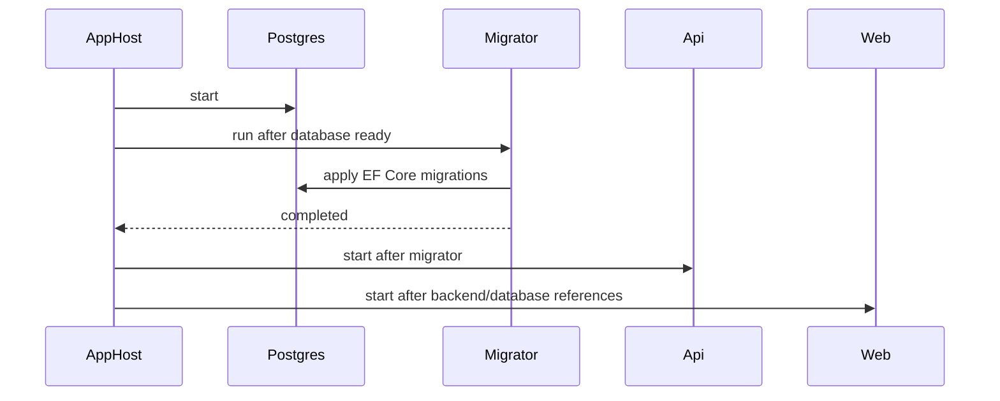

# Migrations と Migrator

## 何を学ぶか

EF Core migrations は、C# の model 変更を database schema の変更履歴として管理する仕組みです。Krafter では migrations を手動で database に適用するのではなく、Aspire AppHost が short-lived migrator process を起動し、main app の前に migration を適用します。

> **なぜ別 process にするのか**: API 起動時に自動 migration を当てる設計もありますが、複数インスタンスが同時起動したときの二重適用リスクや、migration 失敗時に API 起動を場内で止める安全弁として、Krafter は専用の Migrator process を分離しています。AppHost が Migrator の完了を待ってから Backend を起動する際序が、起動失敗の切り分けをしやすくします。

## キーワード

| キーワード | 意味 | Krafter での見え方 |
|---|---|---|
| Migration | schema 変更の履歴 file | `Migrations/*.cs` |
| Model snapshot | 現在の EF model の記録 | `*ModelSnapshot.cs` |
| Design-time factory | CLI が DbContext を作るための補助 | `DesignTimeDbContextFactory.cs` |
| Migrator | migration 適用専用の process | `Backend.Migrator` |
| `WaitForCompletion` | 依存 resource の完了を待つ Aspire API | API/UI が migrator を待つ |

## 図で見る起動順序



この順番を覚えると、起動時に API が落ちたとき「まず migrator の log を見る」という判断ができます。

## Krafterでの実装

- Migration workflow: [README.md](../../../README.md)
- AppHost migrator orchestration: [aspire/AditiKraft.Krafter.Aspire.AppHost/Program.cs](../../../aspire/AditiKraft.Krafter.Aspire.AppHost/Program.cs)
- Migrator entry point: [src/AditiKraft.Krafter.Backend.Migrator/Program.cs](../../../src/AditiKraft.Krafter.Backend.Migrator/Program.cs)
- Database initializer: [src/AditiKraft.Krafter.Backend.Migrator/ApiDbInitializer.cs](../../../src/AditiKraft.Krafter.Backend.Migrator/ApiDbInitializer.cs)
- Main migrations: [src/AditiKraft.Krafter.Backend/Migrations/](../../../src/AditiKraft.Krafter.Backend/Migrations/)
- Tenant migrations: [src/AditiKraft.Krafter.Backend/Migrations/TenantDb/](../../../src/AditiKraft.Krafter.Backend/Migrations/TenantDb/)
- Background job migrations: [src/AditiKraft.Krafter.Backend/Migrations/BackgroundJobs/](../../../src/AditiKraft.Krafter.Backend/Migrations/BackgroundJobs/)

AppHost では `app-migrator` executable を `AddExecutable` で登録し、database を `WaitFor(database)` で待ちます。API と UI は `WaitForCompletion(migrator)` によって migrator 完了後に起動します。

## migration command の読み方

```bash
dotnet ef migrations add AddProjects \
  --project src/AditiKraft.Krafter.Backend \
  --context ApplicationDbContext
```

`--project` は migration を追加する project、`--context` は対象 DbContext です。Krafter には複数 DbContext があるため、ここを間違えると違う migration folder に変更が出ます。

## AppHost 側の簡略コード

```csharp
IResourceBuilder<ExecutableResource> migrator = builder.AddExecutable(
        "app-migrator",
        "dotnet",
        solutionRoot,
        "run",
        "--project",
        migratorProject,
        "--no-launch-profile")
    .WithReference(database)
    .WaitFor(database);

builder.AddProject<Projects.AditiKraft_Krafter_Backend>("api")
    .WithReference(database)
    .WaitForCompletion(migrator);
```

ここでは migrator が「起動しっぱなしの service」ではなく、「完了したら終わる executable」として扱われています。

## 実務で必要な知識

Schema を変える変更では、entity や DbContext だけでなく migration file も必要です。Krafter には複数 DbContext があるため、どの context に対する変更かを間違えないことが重要です。

local development では `dotnet ef migrations add <Name> --context ApplicationDbContext` のように migration を追加し、AppHost を起動して migrator に適用させます。README では context ごとの command が案内されています。

production では migration 適用は慎重に扱います。EF Core の `database update` は便利ですが、production では SQL script や migration bundle、事前検証を使うチームもあります。Krafter の migrator は local/development の体験を簡単にする設計として理解してください。

## 確認課題

- `aspire/.../Program.cs` で migrator、backend、web の依存順序を線で書く。
- `src/AditiKraft.Krafter.Backend/Migrations/DesignTimeDbContextFactory.cs` が何のためにあるか調べる。
- 新しい entity を追加した場合、どの context の migration を作るべきか判断する。

## 出典リンク

- [Managing Migrations](https://learn.microsoft.com/en-us/ef/core/managing-schemas/migrations/managing)
- [Applying Migrations](https://learn.microsoft.com/en-us/ef/core/managing-schemas/migrations/applying)
- [Design-time DbContext Creation](https://learn.microsoft.com/en-us/ef/core/cli/dbcontext-creation)
- [What is the AppHost?](https://learn.microsoft.com/en-us/dotnet/aspire/fundamentals/app-host-overview)
- [Aspire PostgreSQL integration](https://learn.microsoft.com/en-us/dotnet/aspire/database/postgresql-integration)
