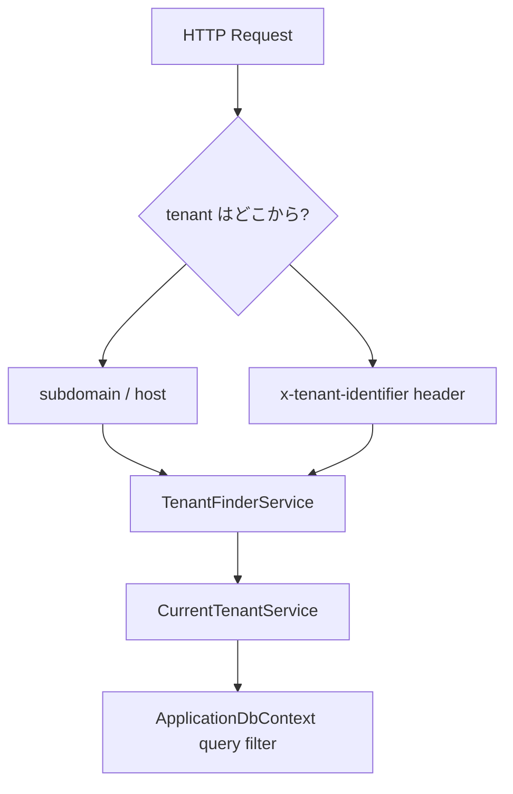

# Multi-tenancy と Soft Delete

## 何を学ぶか

Krafter は tenant-aware な SaaS アプリを作るための構造を持っています。tenant は request から識別され、DbContext の global query filter によって tenant ごとの data に絞り込まれます。また、削除は物理削除ではなく soft delete として扱われます。

Krafter の tenant は 2 種類あります。**root tenant** は SaaS 全体の管理者組織で、全 tenant の設定や追加ができます。**sub tenant** は個々の顧客組織で、自テナントの data のみ操作できます。`PermissionCatalog.Root` に定義された機能は root tenant 専用で、一般組織のユーザーに開放しはいけません。

## キーワード

| キーワード | 意味 | Krafter での見え方 |
|---|---|---|
| Tenant | SaaS の顧客/組織単位 | root tenant、sub tenant |
| Tenant identifier | request から tenant を特定する文字列 | host や `x-tenant-identifier` |
| Global query filter | query に自動で追加される条件 | `TenantId == currentTenant.Id` |
| Soft delete | row を消さず削除済み flag を立てる方式 | `IsDeleted = true` |
| Tenant context | 現在の request の tenant 情報 | `CurrentTenantService` |

## 図で見る tenant 解決



tenant は UI だけの概念ではありません。Backend の request pipeline と DbContext の query filter までつながって初めて、tenant ごとの data isolation が成立します。

## Krafterでの実装

- Tenant context service: [src/AditiKraft.Krafter.Backend/Common/Context/Tenants/CurrentTenantService.cs](../../../src/AditiKraft.Krafter.Backend/Common/Context/Tenants/CurrentTenantService.cs)
- Tenant middleware: [src/AditiKraft.Krafter.Backend/Web/Middleware/MultiTenantServiceMiddleware.cs](../../../src/AditiKraft.Krafter.Backend/Web/Middleware/MultiTenantServiceMiddleware.cs)
- Tenant finder: [src/AditiKraft.Krafter.Backend/Infrastructure/Persistence/Tenants/TenantFinderService.cs](../../../src/AditiKraft.Krafter.Backend/Infrastructure/Persistence/Tenants/TenantFinderService.cs)
- Application query filters and soft delete: [src/AditiKraft.Krafter.Backend/Infrastructure/Persistence/ApplicationDbContext.cs](../../../src/AditiKraft.Krafter.Backend/Infrastructure/Persistence/ApplicationDbContext.cs)
- Tenant header injection in UI: [src/UI/AditiKraft.Krafter.UI.Web.Client/Infrastructure/Refit/RefitTenantHandler.cs](../../../src/UI/AditiKraft.Krafter.UI.Web.Client/Infrastructure/Refit/RefitTenantHandler.cs)
- Tenant URL resolver in UI: [src/UI/AditiKraft.Krafter.UI.Web.Client/Infrastructure/Http/TenantIdentifier.cs](../../../src/UI/AditiKraft.Krafter.UI.Web.Client/Infrastructure/Http/TenantIdentifier.cs)

Backend は request host または `x-tenant-identifier` header から tenant を決めます。UI の Refit handler は request ごとに tenant header を付け、backend URL も tenant に応じて書き換えます。

## query filter と soft delete のイメージ

```csharp
modelBuilder.Entity<ApplicationUser>(entity =>
{
    entity.HasQueryFilter(user =>
        user.IsDeleted == false &&
        user.TenantId == tenantGetterService.Tenant.Id);
});
```

```csharp
case EntityState.Deleted:
    entry.State = EntityState.Modified;
    entry.CurrentValues["IsDeleted"] = true;
    SetTenantAndHistoryInfo(entry);
    break;
```

この 2 つが組み合わさると、削除操作は database row の削除ではなく `IsDeleted = true` への更新になり、通常 query からは見えなくなります。

## 実務で必要な知識

Multi-tenancy では「現在の tenant は誰か」を request の早い段階で決める必要があります。Krafter では middleware が tenant context を設定し、DbContext の query filter が `TenantId` を使って data を絞ります。

Soft delete では、削除操作で row を消さず `IsDeleted = true` にします。これにより監査や復元が可能になりますが、query filter の理解が必要です。`IgnoreQueryFilters()` を使うと soft-deleted data や他 tenant data が見える可能性があるため、実務では慎重に扱います。

tenant-aware な設計では UI 側も重要です。client がどの tenant の API に向けて request しているか、header と URL rewrite の両方を確認します。local development では default tenant を使う path が多いため、production domain の挙動も想像できるようにしておきます。

## 確認課題

- `ApplicationDbContext` の `HasQueryFilter` を探し、どの entity に tenant filter があるか確認する。
- `RefitTenantHandler` が追加する header 名を確認する。
- `DeleteUser.cs` を読み、削除が最終的に soft delete になる流れを追う。

## 出典リンク

- [Global Query Filters - EF Core](https://learn.microsoft.com/en-us/ef/core/querying/filters)
- [Change Tracking in EF Core](https://learn.microsoft.com/en-us/ef/core/change-tracking/)
- [ASP.NET Core Middleware](https://learn.microsoft.com/en-us/aspnet/core/fundamentals/middleware/?view=aspnetcore-10.0)
- [Service discovery in Aspire](https://learn.microsoft.com/en-us/dotnet/aspire/service-discovery/overview)
