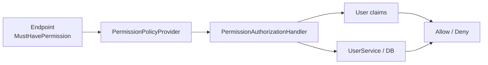

# Permission-based Authorization

## 何を学ぶか

Krafter は role 名だけで endpoint を守るのではなく、permission 名を policy として扱います。`PermissionCatalog` が permission の一覧を定義し、Backend endpoint は `.MustHavePermission(action, resource)` で必要 permission を宣言します。

role-based authorization（例: `[Authorize(Roles = "Admin")]`）は粒度が荒く、「admin は何でもできる」のような設計になりがちです。permission-based では `View Users`、`Create Users`、`Delete Users` のように操作単位で権限を定義するため、「一覧は見られるが作成はできない」といった細かい権限設計が可能です。role は permission の集合として管理するため、role を変えれば付与する permission を柔軟に調整できます。

## キーワード

| キーワード | 意味 | Krafter での見え方 |
|---|---|---|
| Permission | できる操作の細かい単位 | `View Users`, `Create Roles` |
| Role | permission の集合 | admin role など |
| Policy | authorization の判定規則 | permission 名から動的に作成 |
| Claim | user に付与された情報 | permission claim |
| Root permission | root tenant だけに許可する操作 | tenant 管理 |

## 図で見る authorization



UI で button を隠すことと、API を守ることは別です。Krafter では Backend endpoint の permission check が本命で、UI 側は user experience のための補助です。

## Krafterでの実装

- Permission catalog: [src/AditiKraft.Krafter.Contracts/Common/Auth/Permissions/PermissionCatalog.cs](../../../src/AditiKraft.Krafter.Contracts/Common/Auth/Permissions/PermissionCatalog.cs)
- Permission definition: [src/AditiKraft.Krafter.Contracts/Common/Auth/Permissions/PermissionDefinition.cs](../../../src/AditiKraft.Krafter.Contracts/Common/Auth/Permissions/PermissionDefinition.cs)
- Authorization provider/handler: [src/AditiKraft.Krafter.Backend/Web/Authorization/PermissionAuthorization.cs](../../../src/AditiKraft.Krafter.Backend/Web/Authorization/PermissionAuthorization.cs)
- Role permission update: [src/AditiKraft.Krafter.Backend/Features/Roles/UpdateRolePermissions.cs](../../../src/AditiKraft.Krafter.Backend/Features/Roles/UpdateRolePermissions.cs)
- UI permission attribute: [src/UI/AditiKraft.Krafter.UI.Web.Client/Common/Permissions/MustHavePermissionAttribute.cs](../../../src/UI/AditiKraft.Krafter.UI.Web.Client/Common/Permissions/MustHavePermissionAttribute.cs)
- UI permission registration: [src/UI/AditiKraft.Krafter.UI.Web.Client/Features/Auth/Common/RegisterPermissionClaims.cs](../../../src/UI/AditiKraft.Krafter.UI.Web.Client/Features/Auth/Common/RegisterPermissionClaims.cs)

`PermissionPolicyProvider` は policy name が permission claim type で始まる場合、動的に `AuthorizationPolicy` を作ります。`PermissionAuthorizationHandler` は user の claim または database query で permission を確認します。

## permission 定義と endpoint 保護の例

```csharp
new("View Users", PermissionAction.View, PermissionResource.Users)
```

```csharp
userGroup.MapGet("/", ...)
    .MustHavePermission(PermissionAction.View, PermissionResource.Users);
```

この 2 つが対応します。新しい resource を追加するときは、catalog に permission を追加し、endpoint と UI の両方で同じ action/resource を使うようにします。

## 実務で必要な知識

Role は permission の集合として扱うと運用しやすくなります。新しい機能を追加するときは、CRUD などの action と resource を整理し、Backend endpoint と UI navigation/page の両方で同じ permission を使います。

Authorization は UI だけで行ってはいけません。UI で button を隠しても、API が守られていなければ直接 request できます。Krafter では Backend endpoint の `.MustHavePermission` が本体で、UI 側の permission は使いやすさのための表示制御です。

実務では root tenant 用 permission と通常 tenant 用 permission の区別も重要です。`PermissionCatalog.Root` と `PermissionCatalog.Admin` の意味を理解し、tenant 管理のような root-only 操作を一般 user に開放しないようにします。

## 確認課題

- `PermissionCatalog` に定義されている root-only permission を確認する。
- `GetUsers.cs` の `.MustHavePermission` がどの permission 名になるか `PermissionDefinition.NameFor` から推測する。
- UI の Users page がどの attribute で保護されているか確認する。

## 出典リンク

- [Introduction to authorization in ASP.NET Core](https://learn.microsoft.com/en-us/aspnet/core/security/authorization/introduction?view=aspnetcore-10.0)
- [Policy-based authorization in ASP.NET Core](https://learn.microsoft.com/en-us/aspnet/core/security/authorization/policies?view=aspnetcore-10.0)
- [Resource-based authorization in ASP.NET Core](https://learn.microsoft.com/en-us/aspnet/core/security/authorization/resourcebased?view=aspnetcore-10.0)
- [ASP.NET Core Blazor authentication and authorization](https://learn.microsoft.com/en-us/aspnet/core/blazor/security/?view=aspnetcore-10.0)
