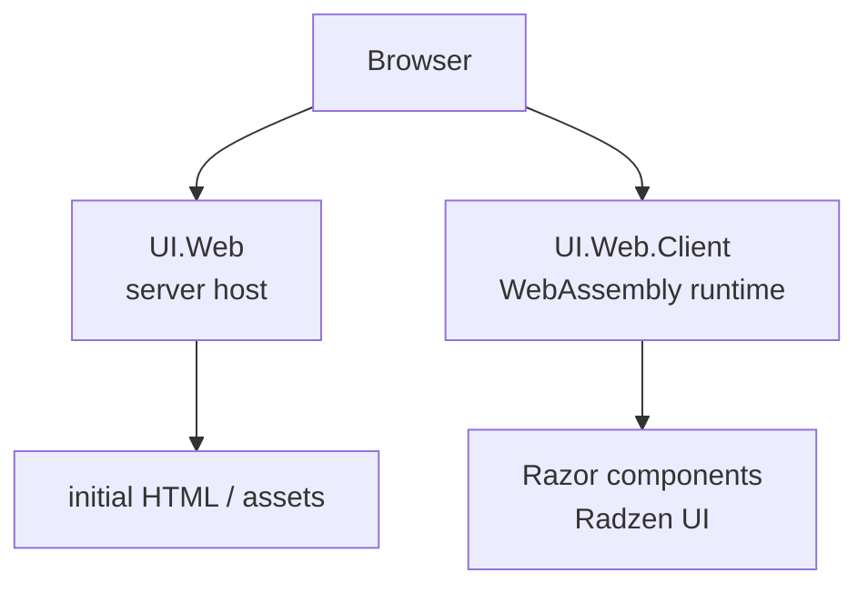

# Blazor Rendering Model

## 何を学ぶか

Krafter の UI は Blazor Web App と Blazor WebAssembly client を組み合わせています。Server 側 host が初期 HTML、static assets、authentication cookie などを扱い、Client project が interactive WebAssembly component を提供します。

## キーワード

| キーワード | 意味 | Krafter での見え方 |
|---|---|---|
| Razor component | Blazor の UI 部品 | `.razor` file |
| Render mode | component をどこで interactive にするか | Interactive WebAssembly / Server |
| Prerender | 最初に server で HTML を生成すること | 初期表示を速くできます |
| WebAssembly | browser 内で .NET code を実行する仕組み | `UI.Web.Client` |
| Code-behind | markup と C# logic を分ける書き方 | `.razor` + `.razor.cs` |
| IFormFactor | server と WASM で異なる実装を差し替える DI interface | server/WASM で別実装を提供 |

## 図で見る Blazor の構成



Krafter の UI は「server だけ」でも「standalone WebAssembly だけ」でもありません。server host と WebAssembly client の役割を分けて読むのがコツです。

## 表示フロー： prerender → WebAssembly interactive

WebAssembly の interactive が始まるまでの流れは次のとおりです。

1. **Prerender** — ブラウザがページを要求すると、server が静的 HTML を生成して返します。ユーザーは即座に画面を見れます。
2. **WASM ダウンロード** — ブラウザがバックグラウンドで .NET runtime と WASM bundle を取得します。
3. **Interactive** — WASM の読み込みが完了すると、component が interactive になり click/input を処理できます。

Next.js などの SSR と同様、prerender による「初表示は速い、その後 interactive」な二段階構成です。WebAssembly を使うことで server 負荷を持たずブラウザ内でロジックを実行できますが、WASM bundle のダウンロード時間分だけ interactive になるまで時間がかかるというトレードオフがあります。

## Krafterでの実装

- Blazor Web host startup: [src/UI/AditiKraft.Krafter.UI.Web/Program.cs](../../../src/UI/AditiKraft.Krafter.UI.Web/Program.cs)
- Blazor client startup: [src/UI/AditiKraft.Krafter.UI.Web.Client/Program.cs](../../../src/UI/AditiKraft.Krafter.UI.Web.Client/Program.cs)
- App component: [src/UI/AditiKraft.Krafter.UI.Web/Components/App.razor](../../../src/UI/AditiKraft.Krafter.UI.Web/Components/App.razor)
- Client routes: [src/UI/AditiKraft.Krafter.UI.Web.Client/Routes.razor](../../../src/UI/AditiKraft.Krafter.UI.Web.Client/Routes.razor)
- Layout component: [src/UI/AditiKraft.Krafter.UI.Web.Client/Common/Components/Layout/MainLayout.razor](../../../src/UI/AditiKraft.Krafter.UI.Web.Client/Common/Components/Layout/MainLayout.razor)

`App.razor` では `InteractiveWebAssemblyRenderMode(true)` を使い、`Routes` と `HeadOutlet` に render mode を渡しています。`Program.cs` は `.AddInteractiveServerComponents()` と `.AddInteractiveWebAssemblyComponents()` を登録します。

## render mode のコード例

```razor
@{
    IComponentRenderMode renderMode = new InteractiveWebAssemblyRenderMode(true);
}

<Routes @rendermode="@renderMode" />
<HeadOutlet @rendermode="@renderMode" />
```

```csharp
builder.Services.AddRazorComponents()
    .AddInteractiveServerComponents()
    .AddInteractiveWebAssemblyComponents();
```

上の Razor は「この component を WebAssembly で interactive にする」指定です。下の C# は「この app で Server/WebAssembly の interactive render mode を使えるようにする」登録です。

## 実務で必要な知識

Blazor Web App では component が server で prerender され、その後 interactive になります。WebAssembly component は client 側で .NET runtime を使って動くため、ブラウザ内で実行できる処理と server 側でしかできない処理を分ける必要があります。

Krafter では `IFormFactor` により server-side と WebAssembly の違いを吸収しています。認証 storage、HTTP context、navigation、SignalR 初期化などは実行場所によって使える API が違います。

UI では `.razor` と `.razor.cs` の code-behind pattern を使います。markup と logic を分けることで、Radzen component の layout と API 呼び出し処理を読みやすくしています。

## 確認課題

- `App.razor` で `Routes` に指定されている render mode を確認する。
- `Program.cs` の server host と client host で登録される service の違いを比較する。
- `IFormFactor` の実装が server と WebAssembly でどう違うか確認する。

## 出典リンク

- [ASP.NET Core Blazor render modes](https://learn.microsoft.com/en-us/aspnet/core/blazor/components/render-modes?view=aspnetcore-10.0)
- [ASP.NET Core Blazor hosting models](https://learn.microsoft.com/en-us/aspnet/core/blazor/hosting-models?view=aspnetcore-10.0)
- [ASP.NET Core Blazor dependency injection](https://learn.microsoft.com/en-us/aspnet/core/blazor/fundamentals/dependency-injection?view=aspnetcore-10.0)
- [Call a web API from an ASP.NET Core Blazor app](https://learn.microsoft.com/en-us/aspnet/core/blazor/call-web-api?view=aspnetcore-10.0)
