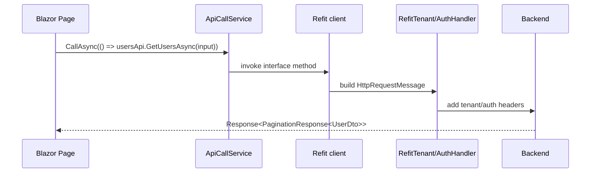

# Radzen、Refit、API Calls

## 何を学ぶか

Krafter の UI は Radzen component で画面を作り、Refit で Backend API を type-safe に呼び出します。画面 component は Refit interface を直接呼ぶのではなく、多くの場合 `ApiCallService` を通じて共通の成功/失敗処理に乗せます。

## キーワード

| キーワード | 意味 | Krafter での見え方 |
|---|---|---|
| Radzen | Blazor UI component library | DataGrid、Dialog、Button |
| Refit | interface から HTTP client を作る library | `IUsersApi` |
| DelegatingHandler | HTTP request の前後処理 | tenant header、auth token |
| `ApiCallService` | API response の共通処理 wrapper | notification/error handling |
| Server-side paging | 必要な page だけ API から取る方式 | `LoadDataArgs` と `GetRequestInput` |

## 図で見る UI から API まで



Refit interface は「HTTP request の型付き説明書」です。実際の URL や header は handler が補います。

## Krafterでの実装

- UI agent rules: [src/UI/Agents.md](../../../src/UI/Agents.md)
- UI service registration: [src/UI/AditiKraft.Krafter.UI.Web.Client/RegisterUIServices.cs](../../../src/UI/AditiKraft.Krafter.UI.Web.Client/RegisterUIServices.cs)
- Refit registration: [src/UI/AditiKraft.Krafter.UI.Web.Client/Infrastructure/Refit/RefitServiceExtensions.cs](../../../src/UI/AditiKraft.Krafter.UI.Web.Client/Infrastructure/Refit/RefitServiceExtensions.cs)
- Users API interface: [src/UI/AditiKraft.Krafter.UI.Web.Client/Infrastructure/Refit/IUsersApi.cs](../../../src/UI/AditiKraft.Krafter.UI.Web.Client/Infrastructure/Refit/IUsersApi.cs)
- Tenant-aware Refit handler: [src/UI/AditiKraft.Krafter.UI.Web.Client/Infrastructure/Refit/RefitTenantHandler.cs](../../../src/UI/AditiKraft.Krafter.UI.Web.Client/Infrastructure/Refit/RefitTenantHandler.cs)
- Users page logic: [src/UI/AditiKraft.Krafter.UI.Web.Client/Features/Users/Users.razor.cs](../../../src/UI/AditiKraft.Krafter.UI.Web.Client/Features/Users/Users.razor.cs)
- API call wrapper: [src/UI/AditiKraft.Krafter.UI.Web.Client/Infrastructure/Services/ApiCallService.cs](../../../src/UI/AditiKraft.Krafter.UI.Web.Client/Infrastructure/Services/ApiCallService.cs)

`RefitServiceExtensions` は `IUsersApi`、`IRolesApi`、`ITenantsApi` などを登録し、`RefitTenantHandler` と `RefitAuthHandler` を message handler として差し込みます。

## ApiCallService の使い方

Refit interface を **直接呼ぶ**と、HTTP エラーや `Response<T>` の失敗判定を毎回自前で書く必要があります。`ApiCallService` を使うと成功/失敗の通知処理が一元化されます。

```csharp
// Refit を直接呼ぶ（非推奨）
var result = await _usersApi.GetUsersAsync(input);
if (!result.IsSuccessful)
    // エラーを自分で通知 ...

// ApiCallService を通す（Krafter 推奨）
await _apiCall.CallAsync(
    () => _usersApi.GetUsersAsync(input),
    onSuccess: response => _users = response.Items);
```

`ApiCallService` は成功時に `onSuccess` callback を実行し、失敗時はアプリ全体の通知サービスへ自動でエラーを伝達します。ページ側は成功時の処理だけ書けばよいので、コードが簡潔になります。

## Refit interface のコード例

```csharp
public interface IUsersApi
{
    [Get("/api/users")]
    Task<Response<PaginationResponse<UserDto>>> GetUsersAsync(
        [Query] GetRequestInput request,
        CancellationToken cancellationToken = default);

    [Delete("/api/users/{id}")]
    Task<Response> DeleteUserAsync(string id, CancellationToken cancellationToken = default);
}
```

`[Query]` は object の property を query string に展開します。`{id}` のような route parameter は method parameter 名と一致させると読みやすく、Refit の binding も安全です。

## 実務で必要な知識

Radzen の DataGrid は server-side paging、filter、sort と相性がよく、Krafter の一覧画面では `LoadDataArgs` を `GetRequestInput` に変換して API に渡します。UI で大量 data をすべて読み込むのではなく、Backend に必要な範囲だけ問い合わせる設計です。

Refit は interface に `[Get]`、`[Post]`、`[Put]`、`[Delete]` を書くと HTTP client を生成します。route parameter 名は Backend の route と一致させます。`{id}` なら method parameter も `id` にする、という小さな一致が実務では重要です。

`RefitTenantHandler` は request ごとに tenant header と culture header を入れ、BaseAddress を runtime に書き換えます。そのため、Refit client 登録時の placeholder URL に驚かず、handler で実際の URL が決まることを理解してください。

## 確認課題

- `Users.razor.cs` の `LoadData` が `GetRequestInput` に何をセットしているか確認する。
- `IUsersApi.DeleteUserAsync` の route と Backend の delete route が一致しているか見る。
- `RefitTenantHandler` が BFF client と Backend client で URL をどう切り替えるか説明する。

## 出典リンク

- [Radzen Blazor Components](https://www.radzen.com/blazor-components/)
- [Radzen DialogService API](https://blazor.radzen.com/docs/api/Radzen.DialogService)
- [Radzen DataGrid OData demo](https://blazor.radzen.com/datagrid-odata)
- [Refit GitHub documentation](https://github.com/reactiveui/refit)
- [Call a web API from an ASP.NET Core Blazor app](https://learn.microsoft.com/en-us/aspnet/core/blazor/call-web-api?view=aspnetcore-10.0)
