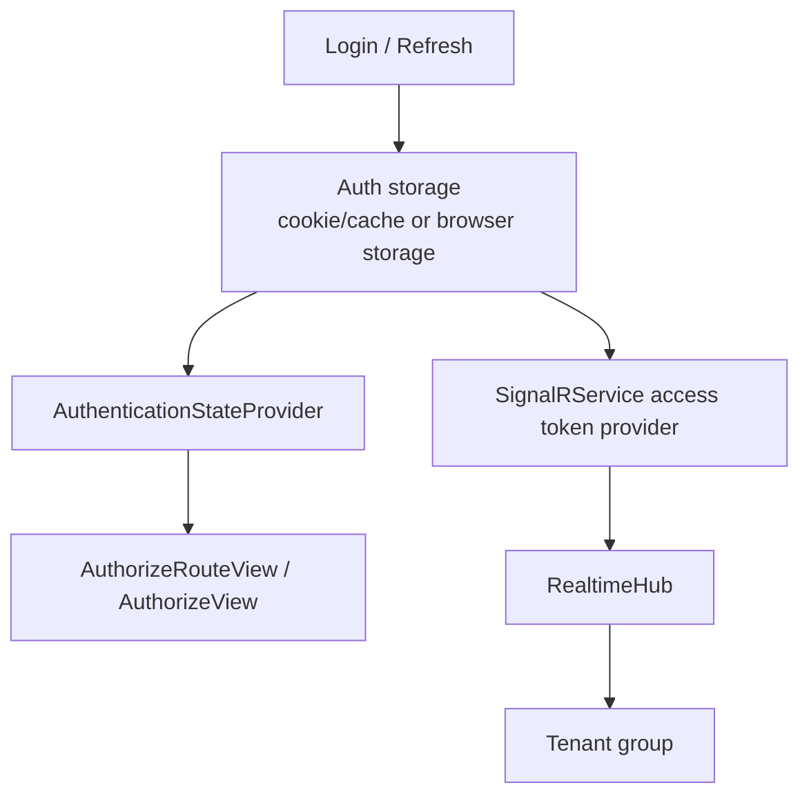

# Auth State、Storage、SignalR

## 何を学ぶか

Krafter の UI は認証状態、token storage、server-side cookie/cache、SignalR real-time connection を扱います。Blazor では `AuthenticationStateProvider` が UI に sign-in 状態を伝え、SignalR はバックグラウンドジョブの完了通知などのリアルタイム機能に使われます。

SignalR を使う理由は、サーバーからクライアントへリアルタイムでメッセージを push するためです。HTTP のポーリング（頂きで確認）はム驄な request が増えるため、Krafter は WebSocket ベースの SignalR 接続を持ったままサーバーから即座にイベントを届けます。

## キーワード

| キーワード | 意味 | Krafter での見え方 |
|---|---|---|
| Authentication state | UI から見た login 状態 | `AuthenticationStateProvider` |
| HttpOnly cookie | JavaScript から読めない cookie | server-side token 保持 |
| Local storage | browser 側の保存領域 | WebAssembly auth token cache |
| SignalR Hub | server 側の realtime endpoint | `RealtimeHub` |
| HubConnection | client 側の SignalR 接続 | `SignalRService` |
| Reconnect | 切断後の再接続 | `WithAutomaticReconnect` |

## 図で見る認証状態と SignalR



UI の表示制御、API 呼び出し、SignalR 接続は、どれも token や authentication state に依存します。1 つだけ直しても、他が古い token を見ていると不具合になります。

## Token の保存パス

Login のレスポンスが届いてから UI が token を使えるまでの流れです。

```
Login response
    ↓
 AuthCookieMiddleware （server host で intercept）
    ├→ HttpOnly Cookie —— サーバーサイド prerender 時に使用
    ├→ Server cache ——— server 内部の高速アクセス用
    └→ WASM local storage — WebAssembly 側が API/SignalR 認証に使用
```

HttpOnly Cookie は JavaScript から読めないため XSS に強く、prerender 時の authentication state の初期化に使われます。WASM 側は Cookie にアクセスできないため、local storage を別途に持ちます。

## Krafterでの実装

- Client auth state provider: [src/UI/AditiKraft.Krafter.UI.Web.Client/Infrastructure/Auth/UIAuthenticationStateProvider.cs](../../../src/UI/AditiKraft.Krafter.UI.Web.Client/Infrastructure/Auth/UIAuthenticationStateProvider.cs)
- Server auth state provider: [src/UI/AditiKraft.Krafter.UI.Web/Services/PersistingServerAuthenticationStateProvider.cs](../../../src/UI/AditiKraft.Krafter.UI.Web/Services/PersistingServerAuthenticationStateProvider.cs)
- Client storage service: [src/UI/AditiKraft.Krafter.UI.Web.Client/Infrastructure/Storage/AuthStorageService.cs](../../../src/UI/AditiKraft.Krafter.UI.Web.Client/Infrastructure/Storage/AuthStorageService.cs)
- Server storage service: [src/UI/AditiKraft.Krafter.UI.Web/Services/AuthStorageServiceServer.cs](../../../src/UI/AditiKraft.Krafter.UI.Web/Services/AuthStorageServiceServer.cs)
- Auth cookie middleware: [src/UI/AditiKraft.Krafter.UI.Web/Services/AuthCookieMiddleware.cs](../../../src/UI/AditiKraft.Krafter.UI.Web/Services/AuthCookieMiddleware.cs)
- SignalR hub: [src/AditiKraft.Krafter.Backend/Infrastructure/Realtime/RealtimeHub.cs](../../../src/AditiKraft.Krafter.Backend/Infrastructure/Realtime/RealtimeHub.cs)
- SignalR client service: [src/UI/AditiKraft.Krafter.UI.Web.Client/Infrastructure/SignalR/SignalRService.cs](../../../src/UI/AditiKraft.Krafter.UI.Web.Client/Infrastructure/SignalR/SignalRService.cs)

`SignalRService` は WebAssembly 実行時に認証済み user だけ HubConnection を作り、access token provider で token を渡します。

## SignalR client のコード例

```csharp
_hubConnection = new HubConnectionBuilder()
    .WithUrl(TenantInfo.HostUrl + $"/{ApiRoutes.ApiPrefix}/RealtimeHub", options =>
    {
        options.AccessTokenProvider = async () =>
        {
            string? token = await _localStorageService.GetCachedAuthTokenAsync();
            return token?.Replace("Bearer ", "").Trim();
        };
    })
    .WithAutomaticReconnect(new[] { TimeSpan.Zero, TimeSpan.FromSeconds(2), TimeSpan.FromSeconds(5) })
    .Build();
```

SignalR は通常の HTTP request と違って接続が続きます。そのため、接続開始時だけでなく、token expiry、reconnect、logout の流れも考える必要があります。

## 実務で必要な知識

Blazor の `AuthenticationStateProvider` は UI の表示判断に使われます。ただし、client-side の認証状態だけでは API は守れません。API endpoint は Backend の JWT bearer authentication と authorization policy で守ります。

Storage は hosting model によって変わります。WebAssembly では browser storage を使いますが、server-side prerender や cookie 管理では server 側 service が必要です。Krafter では `IAuthStorageService` を client/server で差し替え、`AuthCookieMiddleware` が login/refresh response を intercept して HttpOnly cookie と cache に保存します。

SignalR は long-lived connection です。token が期限切れの場合は refresh が必要です。Krafter の `SignalRService` は token 期限を見て refresh を試み、失敗したら logout に進みます。実務では reconnect、tenant group、authorization、server resource 使用量を考慮します。

## 確認課題

- `Routes.razor` の `AuthorizeRouteView` と `Login` 表示の流れを確認する。
- `SignalRService.InitializeAsync` が WebAssembly 以外では早期 return する理由を説明する。
- `RealtimeHub.OnConnectedAsync` が tenant group に connection を追加する流れを読む。

## 出典リンク

- [ASP.NET Core Blazor authentication and authorization](https://learn.microsoft.com/en-us/aspnet/core/blazor/security/?view=aspnetcore-10.0)
- [ASP.NET Core Blazor authentication state](https://learn.microsoft.com/en-us/aspnet/core/blazor/security/authentication-state?view=aspnetcore-10.0)
- [Overview of ASP.NET Core SignalR](https://learn.microsoft.com/en-us/aspnet/core/signalr/introduction?view=aspnetcore-10.0)
- [Use hubs in ASP.NET Core SignalR](https://learn.microsoft.com/en-us/aspnet/core/signalr/hubs?view=aspnetcore-10.0)
- [ASP.NET Core SignalR clients](https://learn.microsoft.com/en-us/aspnet/core/signalr/client-features?view=aspnetcore-10.0)
