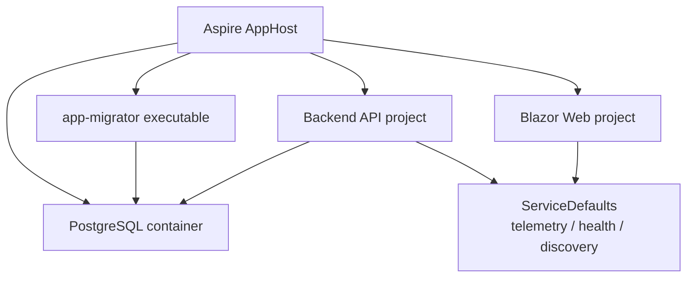

# Aspire、Observability、Health

## 何を学ぶか

Krafter の local development は .NET Aspire AppHost を中心にしています。AppHost は PostgreSQL、Migrator、Backend、UI を resource として宣言し、依存関係、service discovery、dashboard、OpenTelemetry、health checks を扱いやすくします。

## キーワード

| キーワード | 意味 | Krafter での見え方 |
|---|---|---|
| AppHost | local orchestration の入口 project | `aspire/...AppHost/Program.cs` |
| Resource | AppHost が管理する service/container/project | PostgreSQL、api、web |
| Service defaults | 各 service に共通で入れる設定 | telemetry、health、discovery |
| OpenTelemetry | logs/traces/metrics の標準 | Aspire dashboard で観測 |
| Health check | app/resource が動ける状態か確認する仕組み | `/health`, `/alive` |
| Service discovery | service 名から endpoint を解決する仕組み | `WithReference` |

## 図で見る AppHost



AppHost は「全部を起動する main method」です。Docker Compose のような役割を C# code で宣言している、と考えると理解しやすいです。

## Krafterでの実装

- Split Host AppHost: [aspire/AditiKraft.Krafter.Aspire.AppHost/Program.cs](../../../aspire/AditiKraft.Krafter.Aspire.AppHost/Program.cs)
- Single Host AppHost: [aspire-single/AditiKraft.Krafter.Aspire.AppHost/Program.cs](../../../aspire-single/AditiKraft.Krafter.Aspire.AppHost/Program.cs)
- Service defaults: [aspire/AditiKraft.Krafter.Aspire.ServiceDefaults/Extensions.cs](../../../aspire/AditiKraft.Krafter.Aspire.ServiceDefaults/Extensions.cs)
- AppHost settings: [aspire/AditiKraft.Krafter.Aspire.AppHost/appsettings.json](../../../aspire/AditiKraft.Krafter.Aspire.AppHost/appsettings.json)
- Backend startup: [src/AditiKraft.Krafter.Backend/Program.cs](../../../src/AditiKraft.Krafter.Backend/Program.cs)
- UI Web startup: [src/UI/AditiKraft.Krafter.UI.Web/Program.cs](../../../src/UI/AditiKraft.Krafter.UI.Web/Program.cs)

`AddServiceDefaults()` は OpenTelemetry、health checks、service discovery、HttpClient resilience をまとめて登録します。`MapDefaultEndpoints()` は development environment で `/health` と `/alive` を map します。

## AppHost リソース宣言のコード例

次は実際の Krafter Split Host AppHost を簡略化した例です。`WithReference` で依存を伝え、`WaitForCompletion` で起動順序を定義します。

```csharp
var postgres = builder.AddPostgres("postgres")
    .WithDataVolume();

var migrator = builder.AddProject<Projects.Migrator>("app-migrator")
    .WithReference(postgres)
    .WaitFor(postgres);

var api = builder.AddProject<Projects.Backend>("api")
    .WithReference(postgres)
    .WaitForCompletion(migrator)  // migrator 完了待ちに backend が起動
    .WithExternalHttpEndpoints();

var web = builder.AddProject<Projects.Web>("web")
    .WithReference(api)
    .WaitFor(api)
    .WithExternalHttpEndpoints();
```

`WithReference` で辺れられた connection 情報は环境変数として consumer に渡り、service discovery で URL が解決されます。

## ServiceDefaults のコード例

```csharp
builder.ConfigureOpenTelemetry();
builder.AddDefaultHealthChecks();
builder.Services.AddServiceDiscovery();

builder.Services.ConfigureHttpClientDefaults(http =>
{
    http.AddStandardResilienceHandler();
    http.AddServiceDiscovery();
});
```

この code は、各 service に「観測できる」「生存確認できる」「他 service を見つけられる」「HTTP 呼び出しに resilience がある」という基本装備を持たせています。

## 実務で必要な知識

Aspire AppHost は production orchestrator そのものではなく、アプリの構成をコードで表す開発体験の中心です。`WithReference` は依存先の connection string や service discovery 情報を consumer に注入します。`WaitFor` と `WaitForCompletion` は startup order を明確にします。

Observability は logs、traces、metrics の 3 本柱です。Krafter の ServiceDefaults は OpenTelemetry instrumentation を登録し、Aspire dashboard で request、dependency、log を見やすくします。問題調査では、例外 message だけでなく、どの service からどの service に request が流れたかを確認します。

Health check は readiness と liveness の区別が重要です。`/health` は traffic を受けてよいか、`/alive` は process が生きているかの判断に使われます。Krafter では development のみで default endpoints を公開する設定です。

> **なぜ本番で公開しないのか**: `/health` レスポンスには依存サービスの接続状態、バージョン情報などアプリ構成情報が露出する可能性があります。本番で公開する場合は、認証やネットワーク制限を追加して内部ネットワークに限定する設計を模索します。

## 確認課題

- AppHost で PostgreSQL に `.WithDataVolume()` が設定されている理由を説明する。
- `ServiceDefaults/Extensions.cs` の OpenTelemetry instrumentation を列挙する。
- `/health` と `/alive` が development のみで map される理由を考える。

## 出典リンク

- [What is Aspire?](https://learn.microsoft.com/en-us/dotnet/aspire/get-started/aspire-overview)
- [What is the AppHost?](https://learn.microsoft.com/en-us/dotnet/aspire/fundamentals/app-host-overview)
- [Aspire service defaults](https://learn.microsoft.com/en-us/dotnet/aspire/fundamentals/service-defaults)
- [Aspire telemetry](https://learn.microsoft.com/en-us/dotnet/aspire/fundamentals/telemetry)
- [Aspire health checks](https://learn.microsoft.com/en-us/dotnet/aspire/fundamentals/health-checks)
- [Aspire PostgreSQL integration](https://learn.microsoft.com/en-us/dotnet/aspire/database/postgresql-integration)
