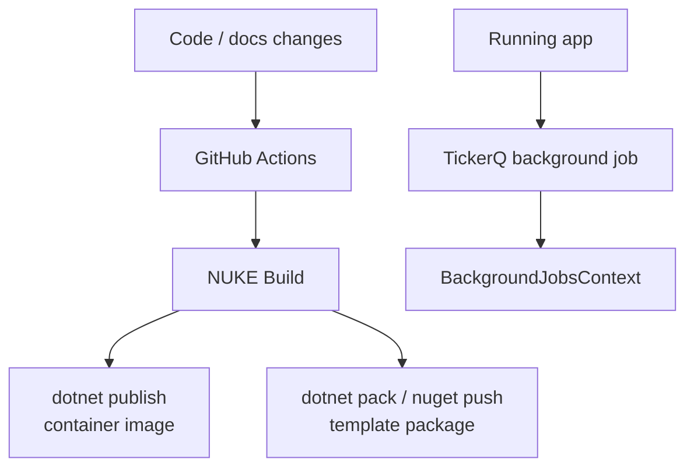

# Background Jobs と Delivery

## 何を学ぶか

Krafter は業務アプリに必要な background jobs、container publish、build automation、GitHub Actions、NuGet template publish の土台を持っています。実務では「機能が動く」だけでなく、非同期処理、配信、template 更新まで理解する必要があります。

## キーワード

| キーワード | 意味 | Krafter での見え方 |
|---|---|---|
| Background job | request の外で後から実行する処理 | TickerQ |
| Retry | 失敗時に再実行する設定 | `RetryIntervals` |
| Container publish | app を container image として発行すること | `PublishProfile=DefaultContainer` |
| Build automation | build/test/publish を script 化すること | NUKE `Build.cs` |
| GitHub Actions | GitHub 上の CI/CD workflow | `.github/workflows/main.yml` |
| NuGet publish | template package を NuGet に公開すること | `dotnet nuget push` |

## 図で見る運用の流れ



Krafter はアプリ本体だけでなく、template として配布するための build/publish も持っています。普通の Web app より一段広い視点が必要です。

## Krafterでの実装

- Background jobs registration: [src/AditiKraft.Krafter.Backend/Infrastructure/Jobs/JobsConfiguration.cs](../../../src/AditiKraft.Krafter.Backend/Infrastructure/Jobs/JobsConfiguration.cs)
- Job service: [src/AditiKraft.Krafter.Backend/Infrastructure/Jobs/JobService.cs](../../../src/AditiKraft.Krafter.Backend/Infrastructure/Jobs/JobService.cs)
- Background jobs DbContext: [src/AditiKraft.Krafter.Backend/Infrastructure/Jobs/BackgroundJobsContext.cs](../../../src/AditiKraft.Krafter.Backend/Infrastructure/Jobs/BackgroundJobsContext.cs)
- NUKE build script: [build/Build.cs](../../../build/Build.cs)
- GitHub Actions workflow: [.github/workflows/main.yml](../../../.github/workflows/main.yml)
- Template package project: [AditiKraft.Krafter.Templates.csproj](../../../AditiKraft.Krafter.Templates.csproj)
- Docker publish commands: [README.md](../../../README.md)

`JobService.EnqueueAsync` は TickerQ の `ITimeTickerManager<TimeTicker>` を使い、指定した function を後で実行する job として登録します。`Build.cs` は Docker image publish と template package publish をまとめています。

## background job のコード例

```csharp
[TickerFunction(nameof(SendEmailJob))]
public async Task SendEmailJob(
    TickerFunctionContext<SendEmailRequestInput> tickerContext,
    CancellationToken cancellationToken)
{
    await emailService.SendEmailAsync(
        tickerContext.Request.Email,
        tickerContext.Request.Subject,
        tickerContext.Request.HtmlMessage,
        cancellationToken);
}
```

```csharp
await timeTickerManager.AddAsync(new TimeTicker
{
    Request = TickerHelper.CreateTickerRequest(requestInput),
    ExecutionTime = DateTime.Now.AddSeconds(1),
    Function = methodName,
    Retries = 3,
    RetryIntervals = [20, 60, 100]
}, cancellationToken);
```

上は「実行される関数」、下は「その関数を job として予約する処理」です。API request の中でメール送信を待つ代わりに、job として登録して後で処理できます。

## 実務で必要な知識

Background job は request/response の外で行う処理です。メール送信、定期処理、重い集計などを API request の中で待たせると user experience と可用性が悪くなります。Krafter では TickerQ を使い、retry interval や dashboard を含む運用を想定しています。

Delivery では `dotnet publish`、container image、registry、secret、CI workflow のつながりを理解します。Krafter の README には `PublishProfile=DefaultContainer` を使った container publish が記載されています。これは Dockerfile を書かずに .NET SDK から container image を作る流れです。

Template 開発では NuGet package としての publish もあります。`dotnet pack` で `.nupkg` を作り、`dotnet nuget push` で公開します。GitHub Actions では `NuGetPAT`、`DeploymentWebhookUrl` などの secret を使うため、secret を repository に書かないことが必須です。

## 確認課題

- `JobsConfiguration.cs` を読み、TickerQ dashboard がどこで有効化されるか確認する。
- `Build.cs` の target 依存関係を追い、template publish までの順序を説明する。
- `.github/workflows/main.yml` がどの branch push で動くか確認する。

## 出典リンク

- [TickerQ: What is TickerQ?](https://tickerq.net/introduction/what-is-tickerq.html)
- [NUKE introduction](https://nuke.build/docs/introduction/)
- [NUKE build anatomy](https://nuke.build/docs/fundamentals/builds/)
- [GitHub Actions workflow syntax](https://docs.github.com/en/actions/reference/workflows-and-actions/workflow-syntax)
- [Containerize an app with dotnet publish](https://learn.microsoft.com/en-us/dotnet/core/containers/sdk-publish)
- [dotnet pack command](https://learn.microsoft.com/en-us/dotnet/core/tools/dotnet-pack)
- [dotnet nuget push command](https://learn.microsoft.com/en-us/dotnet/core/tools/dotnet-nuget-push)
