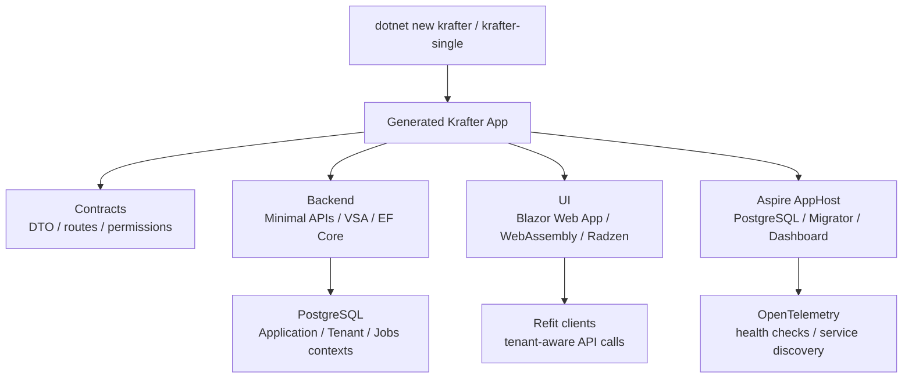

# Krafter 入門学習ガイド

このディレクトリは、.NET や Microsoft 系技術にまだ慣れていない開発者が、Krafter を使って実務的に機能追加・保守・運用できるようになるための学習記事群です。

Krafter は単なるサンプルではなく、`dotnet new` で利用する .NET 10 のフルスタックアプリケーションテンプレートです。学習では、まずテンプレートとしての使い方を理解し、その後に ASP.NET Core、Blazor、Entity Framework Core、認証、Aspire、配信の順に広げていきます。

## 移動中に読むためのコツ

この記事群は、手を動かせない時間でも理解できるように「キーワード」「図」「小さなコード例」を足しています。まず本文を読み、知らない言葉が出たら各記事のキーワード欄だけ見返してください。実装リンクは、あとで PC の前に戻ったときに確認するための地図です。

読み進めるときは、細かい API 名を暗記するよりも、次の 3 つを意識すると腹落ちしやすくなります。

- request はどこから入り、どの project を通って database や UI に届くのか。
- 共通化されている仕組みは何で、feature ごとに書くべきものは何か。
- local development、authentication、migration、deployment の責務がどの層に分かれているか。

## 全体図

Mermaid が表示されない環境では、上から「テンプレートでアプリ生成」「Contracts/Backend/UI/Aspire に分かれる」「Backend は database、UI は API 呼び出し、Aspire は起動と観測を担当」と読んでください。

## キーワード早見表

| キーワード | ざっくりした意味 | Krafter で見る場所 |
|---|---|---|
| `dotnet new` | テンプレートから新しい project を作る CLI | `.template.config/` |
| Contracts | Backend と UI が共有する DTO、route、permission | `src/AditiKraft.Krafter.Contracts/` |
| VSA | ユースケース単位で Backend code をまとめる構成 | `src/AditiKraft.Krafter.Backend/Features/` |
| Minimal APIs | Controller ではなく `MapGet` などで endpoint を作る方式 | Backend の `Features/*/*.cs` |
| Blazor Web App | Server と WebAssembly の render mode を扱う UI | `src/UI/` |
| EF Core | C# から database を扱う ORM | `ApplicationDbContext.cs` |
| Aspire AppHost | local 開発時の複数 service 起動と dashboard | `aspire/.../Program.cs` |

## 学習順

1. [基礎: .NET CLI と SDK](01-foundation/01-dotnet-cli-and-sdk.md)
2. [基礎: Krafter で使われる C#](01-foundation/02-csharp-basics-used-in-krafter.md)
3. [基礎: dotnet new テンプレートの使い方](01-foundation/03-dotnet-template-workflow.md)
4. [アーキテクチャ: ソリューション構成](02-architecture/01-solution-structure.md)
5. [アーキテクチャ: Split Host と Single Host](02-architecture/02-split-host-vs-single-host.md)
6. [アーキテクチャ: Vertical Slice Architecture](02-architecture/03-vertical-slice-architecture.md)
7. [バックエンド: ASP.NET Core Minimal APIs](03-backend/01-aspnet-core-minimal-apis.md)
8. [バックエンド: DI、Options、Middleware](03-backend/02-dependency-injection-options-middleware.md)
9. [バックエンド: Response、Validation、Error Handling](03-backend/03-response-validation-and-errors.md)
10. [データ: EF Core と PostgreSQL](04-data/01-ef-core-and-postgresql.md)
11. [データ: Migrations と Migrator](04-data/02-migrations-and-migrator.md)
12. [データ: Multi-tenancy と Soft Delete](04-data/03-multitenancy-and-soft-delete.md)
13. [セキュリティ: Identity、JWT、Google Auth](05-security/01-identity-jwt-google-auth.md)
14. [セキュリティ: Permission-based Authorization](05-security/02-permission-based-authorization.md)
15. [UI: Blazor Rendering Model](06-ui/01-blazor-rendering-model.md)
16. [UI: Radzen、Refit、API Calls](06-ui/02-radzen-refit-api-calls.md)
17. [UI: Auth State、Storage、SignalR](06-ui/03-auth-state-storage-and-signalr.md)
18. [運用: Aspire、Observability、Health](07-operations/01-aspire-observability-health.md)
19. [運用: Background Jobs と Delivery](07-operations/02-background-jobs-and-delivery.md)

## Krafterでの実装

最初に読むとよいローカル実装は次の通りです。

- テンプレート利用の全体像: [README.md](../../README.md)
- AI エージェント向け実装ルール: [Agents.md](../../Agents.md)
- Split Host の AppHost: [aspire/AditiKraft.Krafter.Aspire.AppHost/Program.cs](../../aspire/AditiKraft.Krafter.Aspire.AppHost/Program.cs)
- Backend の起動処理: [src/AditiKraft.Krafter.Backend/Program.cs](../../src/AditiKraft.Krafter.Backend/Program.cs)
- Backend 共通登録: [src/AditiKraft.Krafter.Backend/Web/HostingExtensions.cs](../../src/AditiKraft.Krafter.Backend/Web/HostingExtensions.cs)
- Blazor Web host: [src/UI/AditiKraft.Krafter.UI.Web/Program.cs](../../src/UI/AditiKraft.Krafter.UI.Web/Program.cs)
- Blazor WebAssembly client: [src/UI/AditiKraft.Krafter.UI.Web.Client/Program.cs](../../src/UI/AditiKraft.Krafter.UI.Web.Client/Program.cs)
- Shared contracts: [src/AditiKraft.Krafter.Contracts/](../../src/AditiKraft.Krafter.Contracts/)

## 実務で必要な知識

Krafter を実務で使うには、個別技術を暗記するよりも「変更がどこを通るか」を追えることが重要です。たとえばユーザー管理機能を変更する場合、Contracts の DTO、Backend の VSA operation、EF Core の DbContext、UI の Refit interface、Blazor page、permission の定義が連動します。

また、Krafter はローカル開発を Aspire AppHost に寄せています。通常は個別プロジェクトを直接起動するより、AppHost を起動し、PostgreSQL、Migrator、API、UI の依存関係をまとめて見るほうが理解しやすいです。

## 確認課題

- `README.md` の「Template Variants」を読み、Split Host と Single Host の違いを自分の言葉で説明する。
- `src/AditiKraft.Krafter.Backend/Features/Users/GetUsers.cs` と `src/UI/AditiKraft.Krafter.UI.Web.Client/Features/Users/Users.razor.cs` を開き、一覧画面の API 呼び出しがどのようにつながるか追跡する。
- `aspire/AditiKraft.Krafter.Aspire.AppHost/Program.cs` を読み、どのリソースがどの順番で起動するか整理する。

## 出典リンク

- [.NET CLI overview](https://learn.microsoft.com/en-us/dotnet/core/tools/dotnet)
- [dotnet new command](https://learn.microsoft.com/en-us/dotnet/core/tools/dotnet-new)
- [Custom templates for dotnet new](https://learn.microsoft.com/en-us/dotnet/core/tools/custom-templates)
- [What is Aspire?](https://learn.microsoft.com/en-us/dotnet/aspire/get-started/aspire-overview)
- [ASP.NET Core Blazor render modes](https://learn.microsoft.com/en-us/aspnet/core/blazor/components/render-modes?view=aspnetcore-10.0)
